## Azure Service Operator による Azureリソースの利用

### [デモ] Azure Service Operatorの利用準備

※ここで紹介している内容は、インストラクターによって紹介されるデモ手順であり、受講者はコマンド/GUI操作を実施する必要はありません。次の「[ハンズオン] Azure Service Operatorを利用したAzure Virtual Networkの作成」まで読み進めて下さい。

AROに含まれるRed Hat OpenShiftのOperatorHubでは、Kubernetes/OpenShiftからAzureのリソースを簡単に作成/削除できるようになっている[Azure Service Operator](https://github.com/Azure/azure-service-operator)というOperatorを用意しています。この演習では、Azure Service Operatorを利用して、Azureのリソースの1つである[Azure Virtual Network](https://azure.microsoft.com/ja-jp/pricing/details/virtual-network/)を利用するための設定を行います。

**[Tips]** Operatorは、Kubernetes/OpenShift上で実行されるコンテナアプリの運用(自動構築や削除など)を自動化するための、専用コンテナとなります。Operatorは、対象となるコンテナアプリを運用するためのインタフェースを提供します。このインタフェースの利用例については、後述する「[ハンズオン] Azure Service Operatorを利用したAzure Virtual Networkの作成」でご紹介します。なお、Operator自身も通常のアプリケーションと同様に、Podとして実行されます。

最初に、Azure CLIを利用してAzureにログインした後に、アカウントの情報を確認します。ここで確認できる「id」の値をメモしておきます。
```
$ az login
$ az account show
{
  "environmentName": "AzureCloud",
...<略>...
  "id": "XXXXXXXXXXXXX",
...<略>...
  "user": {
    "name": "hkojima@redhat.com",
    "type": "user"
  }
}
```

次に、Azureのサービスプリンシパルを作成して、事前に用意しておいたAzureのリソースグループに対する「ネットワーク共同作成者(network contributor)」の権限を割り当てます。これにより、指定したリソースグループに対して、このサービスプリンシパルを利用したAzure Virtual Networkリソースが作成できるようになります。ここでは任意の名前のサービスプリンシパルを指定し、リソースグループ名として「aro-handson-rg」を指定しています。「XXXXXXXXXXXXX」となっているところはAzureサブスクリプションIDであり、前述にメモしておいた「id」の値となります。
```
$ az ad sp create-for-rbac -n <任意の名前のサービスプリンシパル> --role "network contributor" --scopes /subscriptions/XXXXXXXXXXXXX/resourceGroups/aro-handson-rg
Creating 'network contributor' role assignment under scope '/subscriptions/XXXXXXXXXXXXX/resourceGroups/aro-handson-rg'
The output includes credentials that you must protect. Be sure that you do not include these credentials in your code or check the credentials into your source control. For more information, see https://aka.ms/azadsp-cli
{
  "appId": "XXXXXXXXXXXXX",
  "displayName": <任意の名前のサービスプリンシパル>,
  "password": "XXXXXXXXXXXXX",
  "tenant": "XXXXXXXXXXXXX"
}
```

ここで表示される「appId」「password」「tenant」の値をメモしておきます。この「az ad sp create-for-rbac」コマンドの実行により、次のようなロールの割り当て画面がAzure Portal上で確認できます。

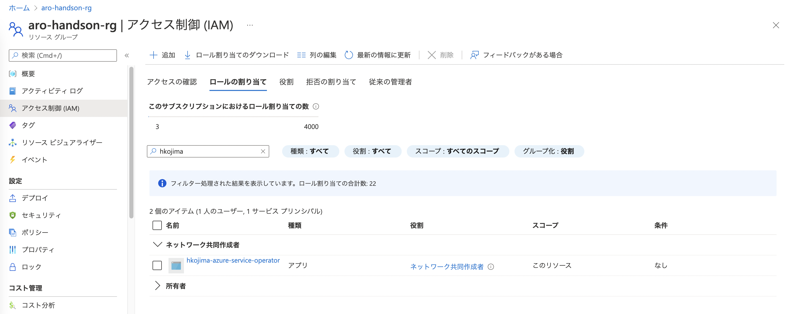
<div style="text-align: center;">リソースグループに対するロールの割り当ての作成結果</div>　


これらのメモしておいた4つの値をもとに、Azure Service Operatorが利用する認証情報としてのOpenShiftシークレットを作成します。各パラメータの説明は次のとおりです。

- `name`: 作成するシークレットの名前。Azure Service Operatorは「azureoperatorsettings」という名前のシークレットを利用するようになっているので、この名前を指定
- `namespace`: シークレットを作成場所となるプロジェクト名。Azure Service Operatorがインストールされる「openshift-operators」を指定
- `AZURE_TENANT_ID`: [Azure Active DirectoryのテナントID](https://learn.microsoft.com/ja-jp/azure/active-directory/fundamentals/active-directory-how-to-find-tenant)。メモしておいた「tenant」の値を指定
- `AZURE_SUBSCRIPTION_ID`: AzureのサブスクリプションID。メモしておいた「id」の値を指定
- `AZURE_CLIENT_ID`: AzureのサービスプリンシパルID。メモしておいた「appId」の値を指定
- `AZURE_CLIENT_SECRET`: 上記サービスプリンシパルのシークレット。メモしておいた「password」の値を指定

```
$ cat << EOF  > azure-service-operator-secrets.txt 
apiVersion: v1
kind: Secret
metadata:
  name: azureoperatorsettings
  namespace: openshift-operators
stringData:
  AZURE_TENANT_ID: XXXXXXXXXXXXX
  AZURE_SUBSCRIPTION_ID: XXXXXXXXXXXXX
  AZURE_CLIENT_ID: XXXXXXXXXXXXX
  AZURE_CLIENT_SECRET: XXXXXXXXXXXXX
EOF
$ oc create -f azure-service-operator-secrets.txt
secret/azureoperatorsettings created
```

最後にAzure Service OperatorをOperatorHubからインストールします。OpenShiftに管理ユーザでログインし、Administratorパースペクティブの「OperatorHub」から、Azure Service Operatorを選択して、「続行」→「インストール」→「インストール」をクリックして、Operatorのインストールを完了します。パラメータは全てデフォルト値を使用します。

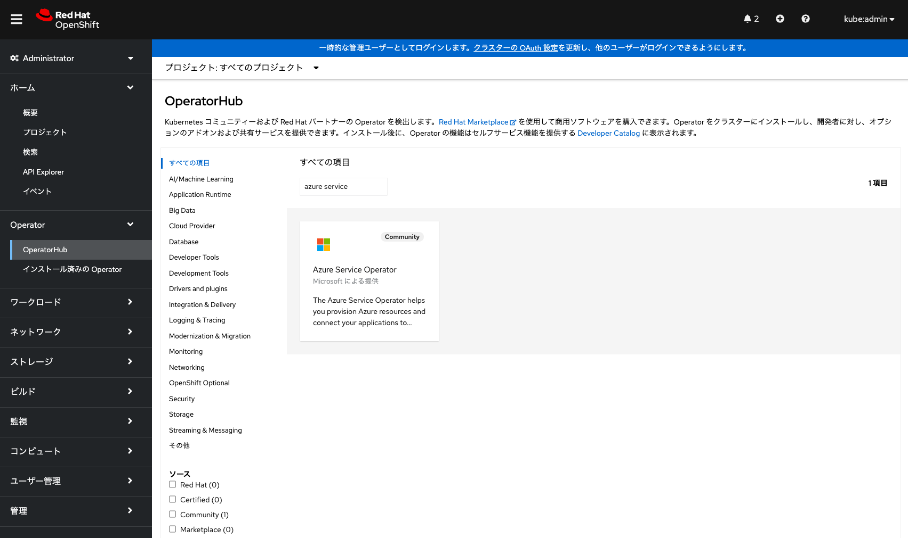
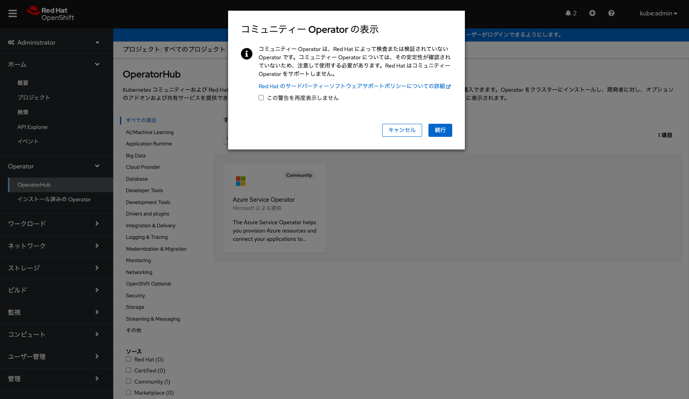
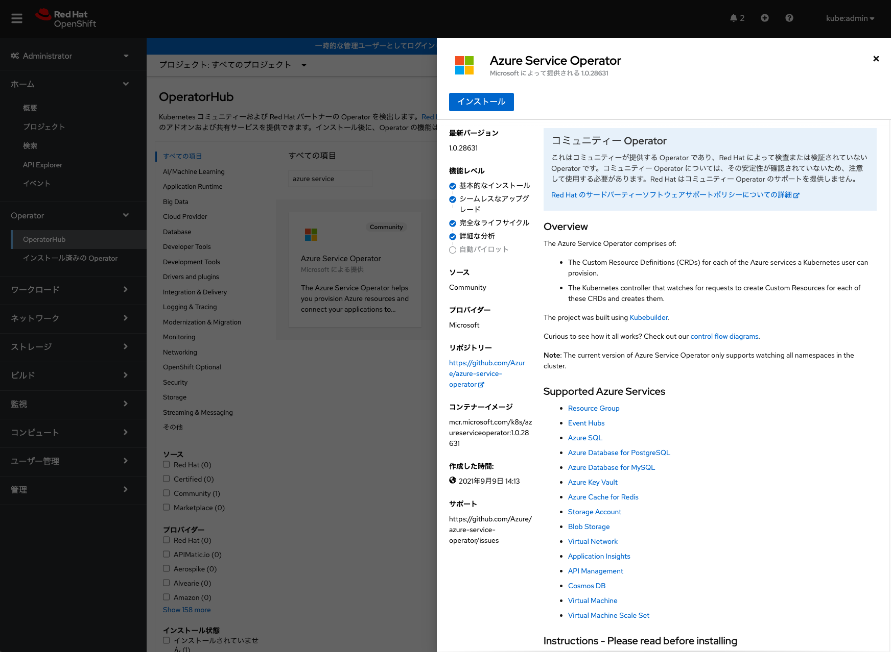
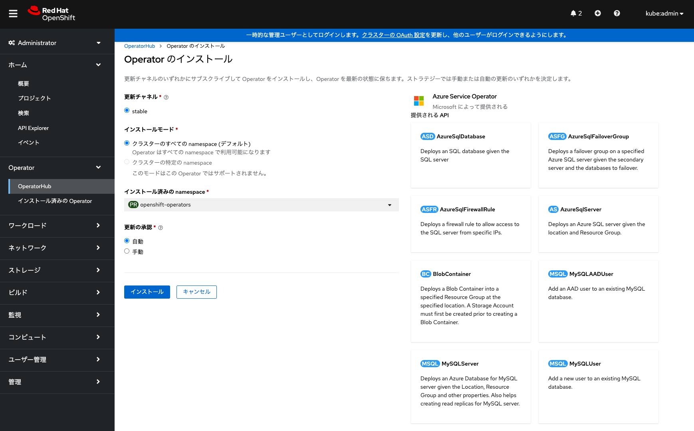
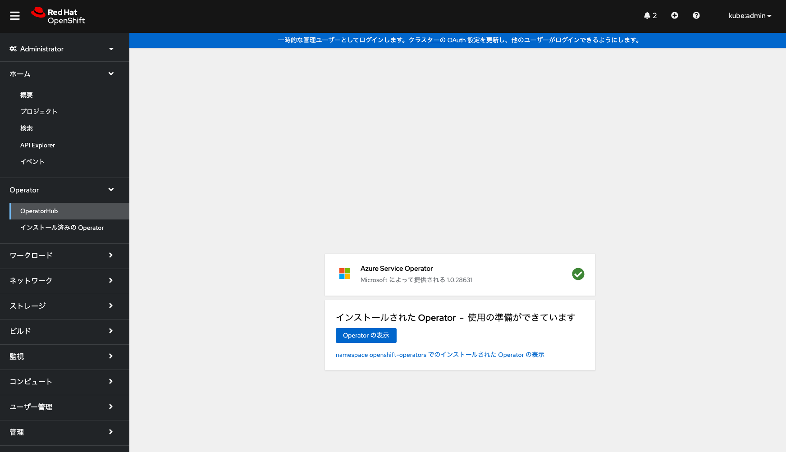
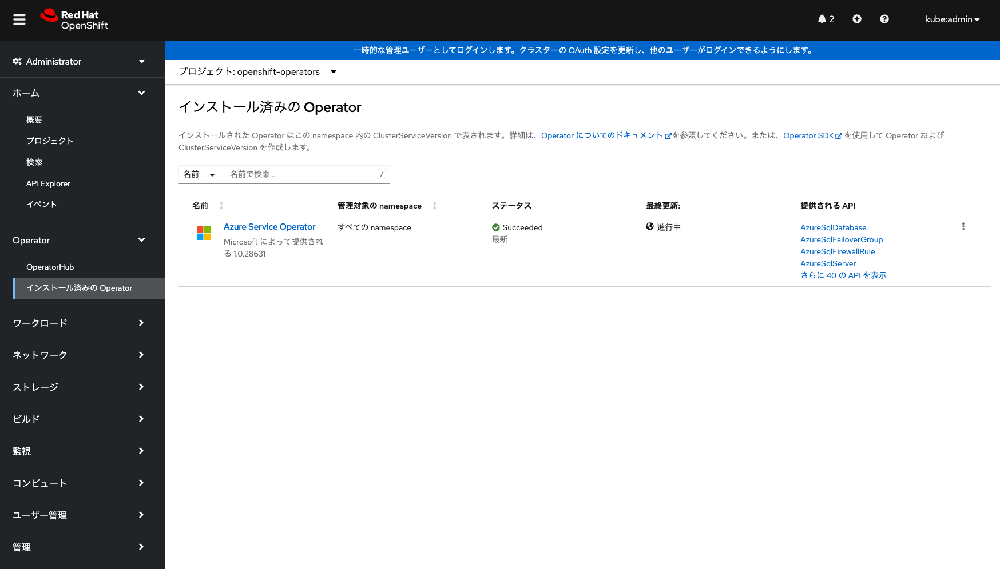
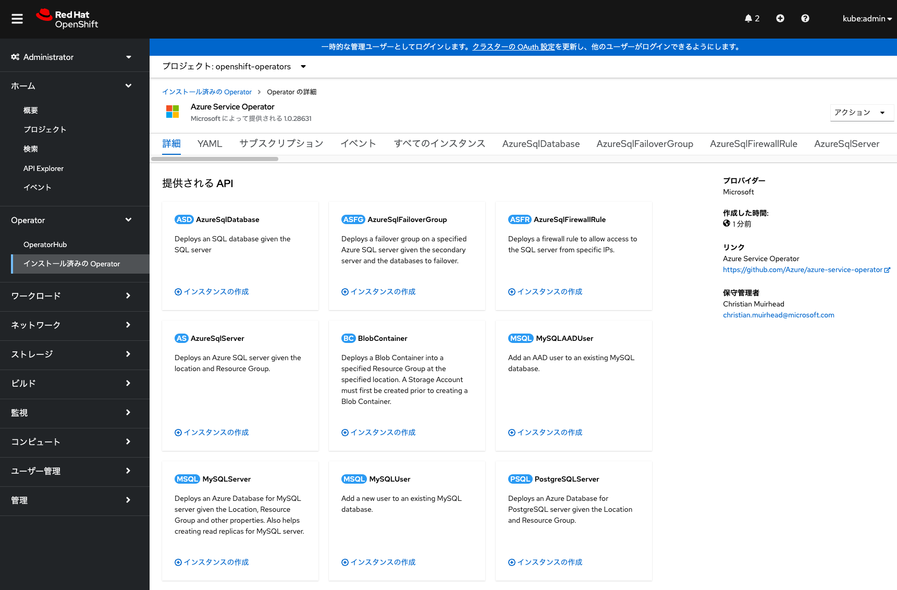
<div style="text-align: center;">Azure Service Operatorのインストール</div>　

これでAzure Service Operatorを利用する準備は完了です。


### [ハンズオン] Azure Service Operatorを利用したAzure Virtual Networkの作成

前述の手順でインストールされたAzure Service Operatorを利用して、Azure Virtual Networkのリソースを作成します。ここからはAROのローカルユーザでの作業となります。

Administratorパースペクティブの「インストール済みのOperator」から「Azure Service Operator」を選択して、右上メニューの「VirtualNetwork」を選択します。そして、「VirtualNetworkの作成」をクリックして、各パラメータの値を入力します。

- `名前`: 任意の名前を指定できますが、この演習では1つのAzureリソースグループの中に複数のVirtual Networkを作成するため、名前の重複はできません。そのため、他の受講者が指定するリソース名と重複しないような名前(この例では「test-vnet-sample-20」)を指定してください。
- `Location`: 作成するVirtual Networkのリージョンを指定します。本演習では「JapanEast」を指定します。なお、このリージョンは、リソースグループのリージョンと違うリージョン、例えば「SouthCentralUS」などを指定することもできます。
- `ResourceGroup`: 予め作成しておいたリソースグループの名前を指定します。本演習では「aro-handson-rg」を指定します。このリソースグループの中に、Virtual Networkリソースが作成されます。

アドレス空間やサブネットも指定できますが、これらはデフォルトの値を利用します。最後に「作成」をクリックして、Virtual Networkのリソースを作成します。

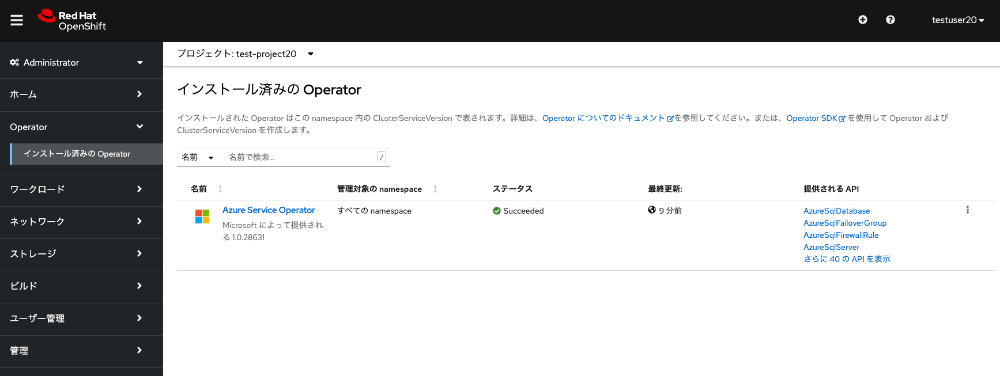
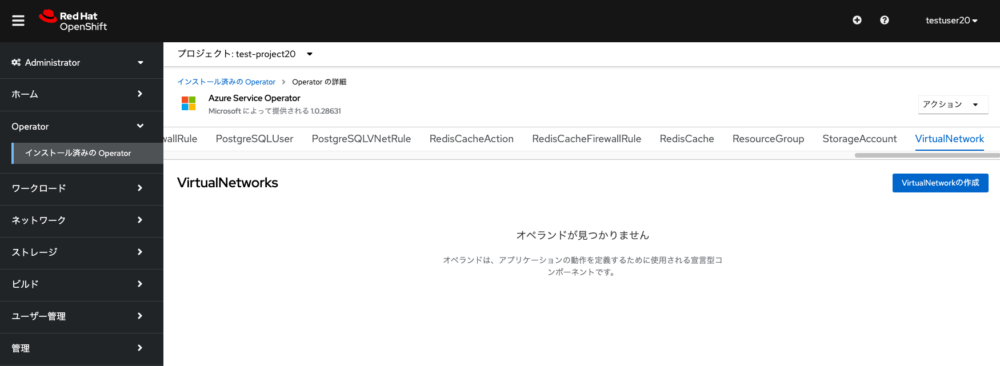
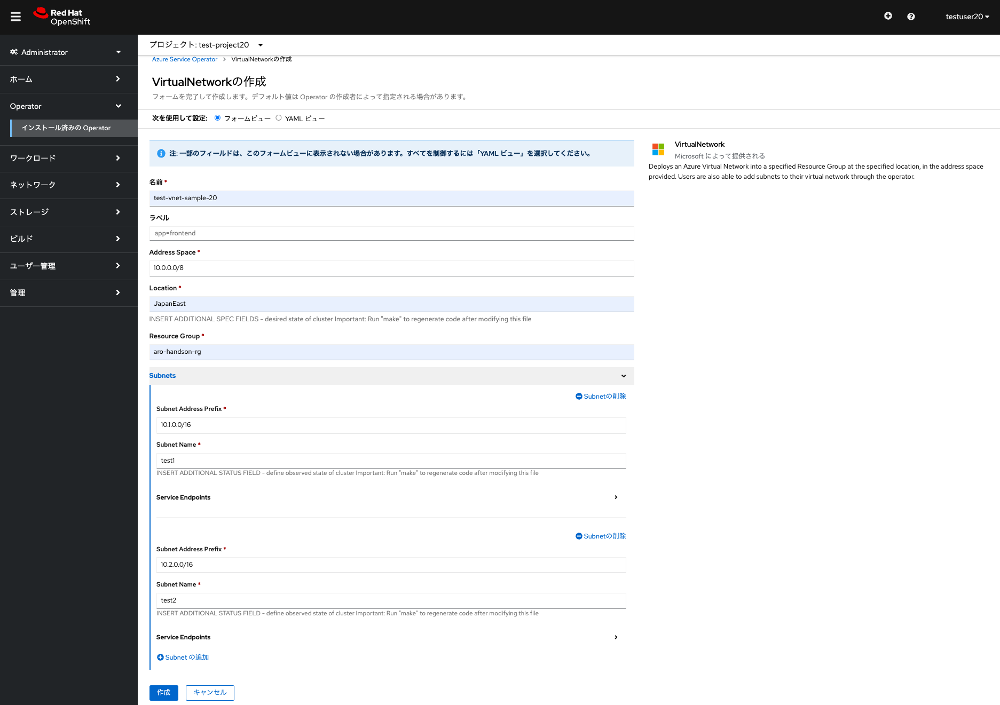
<div style="text-align: center;">Azure Virtual Networkのリソース作成 その1</div>　

作成したVirtual Networkのリソースが表示されます。これを選択して「イベント」に、「Successfully reconciled」というメッセージが表示されていれば、リソース作成の完了です。

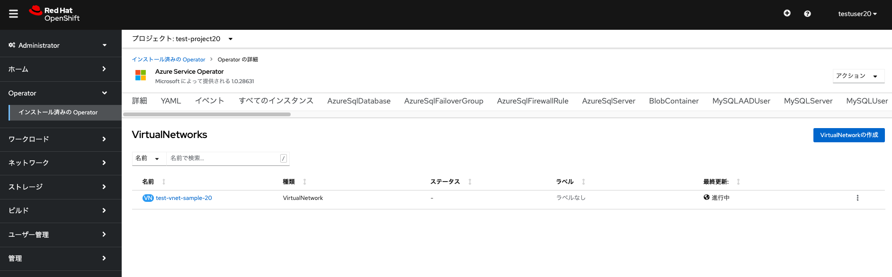
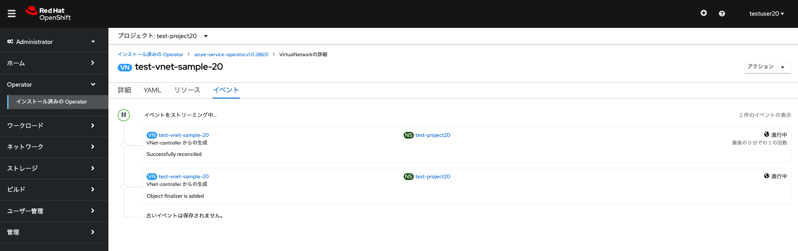
<div style="text-align: center;">Azure Virtual Networkのリソース作成 その2</div>　

作成したVirtual Networkのリソースは、Azure Portalで確認することもできます。この演習では、受講者はAzure Portalへのアクセス権限を持たないことを想定しますので、実際にアクセスして確認することはできません。

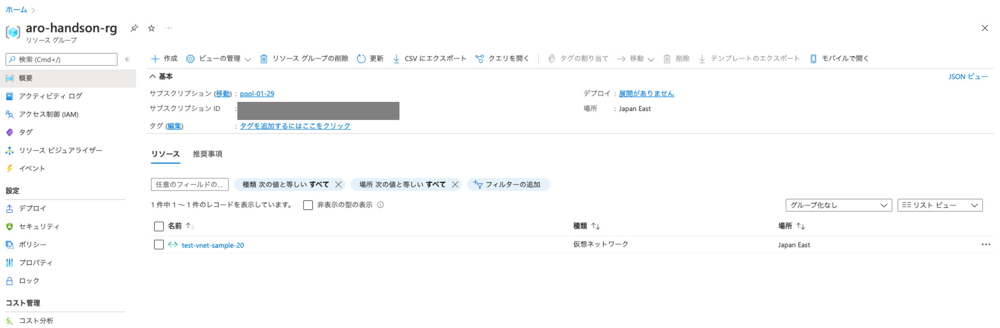
<div style="text-align: center;">Azure PortalでのVirtual Networkリソースの確認</div>　

Azure Service Operatorで作成したAzure Virtual Networkのリソースを削除するには、当該リソースを選択して、右上の「アクション」→「VirtualNetworkの削除」から削除できます。これにより、リソースが削除され、Azure Portalの画面からも削除されます。

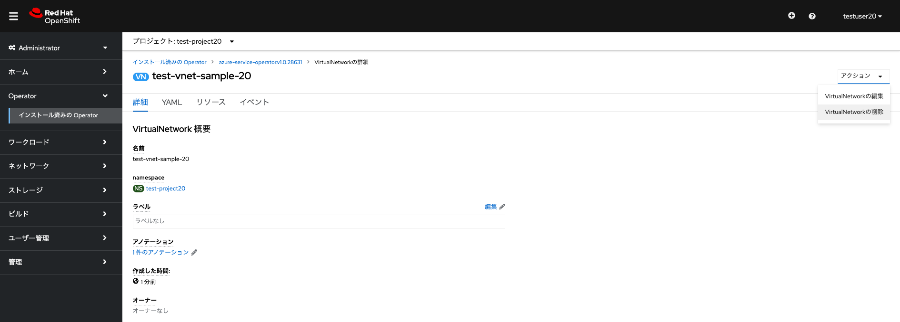
<div style="text-align: center;">Virtual Networkリソースの削除</div>　


これでAROクラスターでの、Azure Service Operator による Azureリソースの利用方法の確認が完了しました。次の演習の[AROクラスターのロギングとモニタリング](../aro-logs-and-monitor)に進んでください。


[HOME](../../README.md)
