## AROクラスターの作成

### 前準備

AROクラスターには、少なくともトータルで40コア以上の仮想マシンを作成する必要があります。Azureリソースクォータがこの要件を満たさない場合、リソースの制限値の引き上げが必要となります。詳細は下記をご参照ください。

**[参考情報]** [「チュートリアル: Azure Red Hat OpenShift 4 クラスターを作成する」の「開始する前に」](https://learn.microsoft.com/ja-jp/azure/openshift/tutorial-create-cluster#before-you-begin) を参照

Azure PortalかAzure CLI(バージョン 2.6.0 以降)を利用して、AROクラスターをデプロイできます。Azure Portalを利用する場合は、Azure Portalにサインインして、AROを利用するための[サービスプリンシパル](https://docs.microsoft.com/ja-jp/azure/active-directory/develop/howto-create-service-principal-portal)(各ユーザーに設定するRBACのように、各サービスに設定可能なRBAC. Azure特有用語)を作成する必要があります。「Azure PortalからAROを作成する」というサービスが、「AROクラスターについての読み書き(作成/削除)を可能にする」権限を、サービスプリンシパルによって設定します。

サービスプリンシパルは、Azure Active Directoryのメニューから作成できます。[Azure Portal](https://portal.azure.com)にログインして、「Azure Active Directory」メニューを選択し、「アプリの登録」をクリックします。その後、アプリケーションの登録画面で、任意のアプリケーション名(この例では、aro4)を入力して、残りのパラメータはデフォルトのまま「登録」をクリックします。


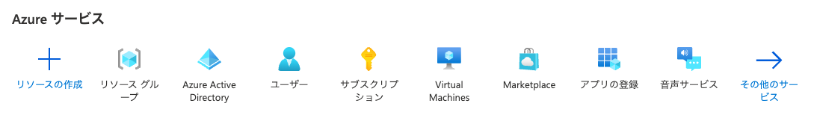
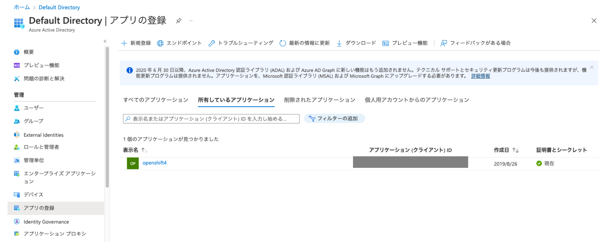
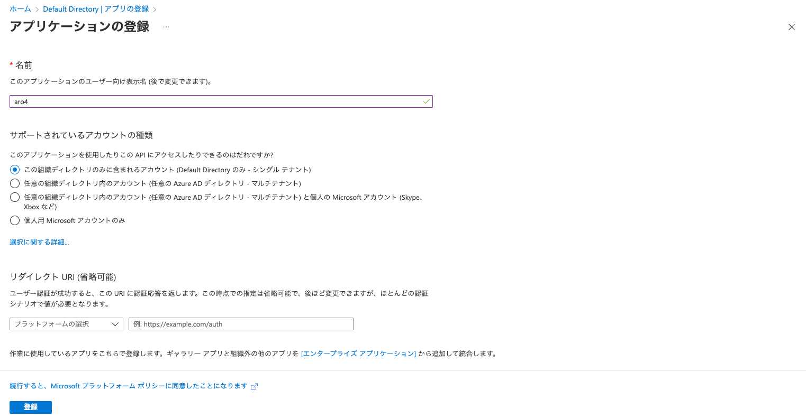
<div style="text-align: center;">Azureアプリケーションの登録</div>　　


ここで登録したサービスプリンシパルのシークレットを新規作成します。左サイドメニューの「シングルサインオン」をクリックして、表示される説明の「...エクスペリエンスの aro4 に移動して、...」の「aro4」をクリックします。表示された左サイドメニューの「証明書とシークレット」から、「+新しいクライアントシークレット」をクリックして、新規シークレットを追加します。ここで表示される「値」がサービスプリンシパルのシークレットとなります。


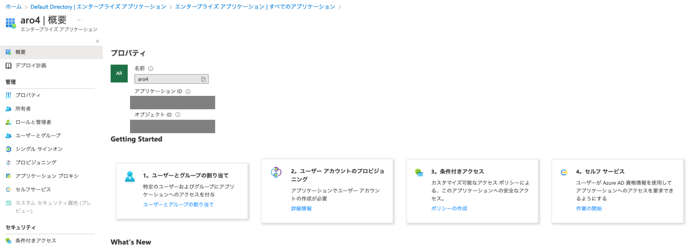
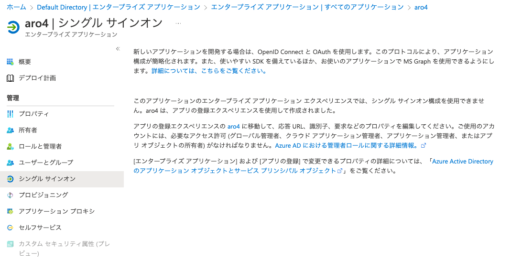
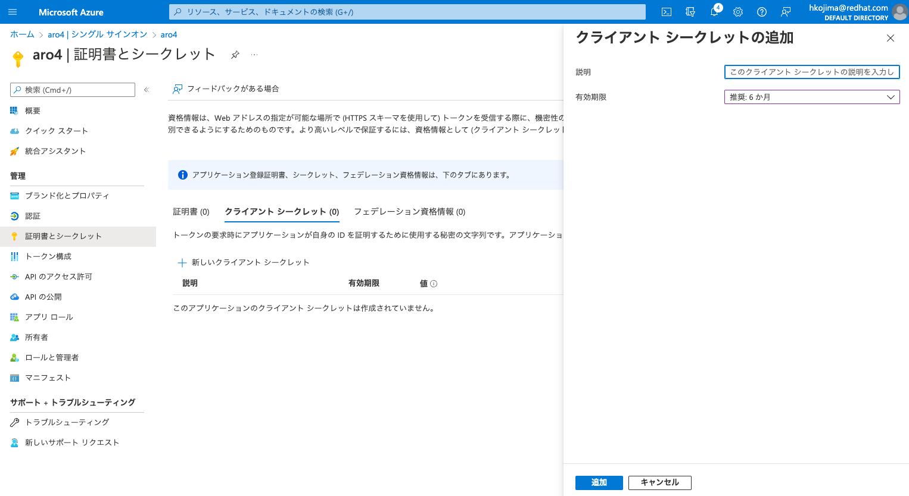
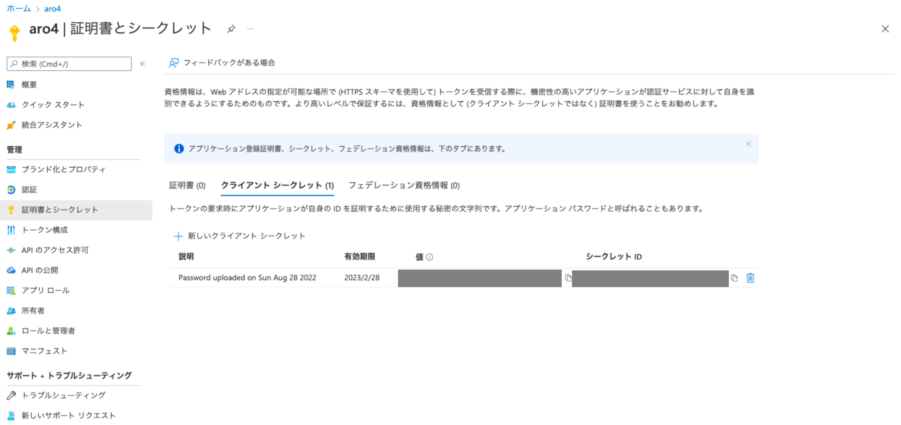
<div style="text-align: center;">サービスプリンシパルのシークレット作成</div>　　


上記画像にあるサービスプリンシパルの下記の値を、AROクラスターデプロイ時に利用しますので、メモしておいてください。

- <b>アプリケーションID</b> (オブジェクトIDではありません)
- <b>クライアントシークレットの「値」</b> (シークレットIDではありません)
<div style="text-align: center;"></div>　　


次に、Azure上のARO作成場所となる、リソースグループを作成します。Azureサービスから「リソースグループ」を選択して、左上の「+作成」をクリックし、Azureサービスデプロイ時に利用するサブスクリプションを選択、任意のリソースグループ名を入力、リージョンを選択して、「確認および作成」から作成します。これらのパラメータは、利用するAzureアカウントに応じて適宜変更してください。


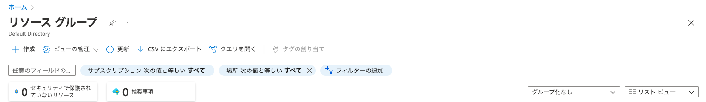
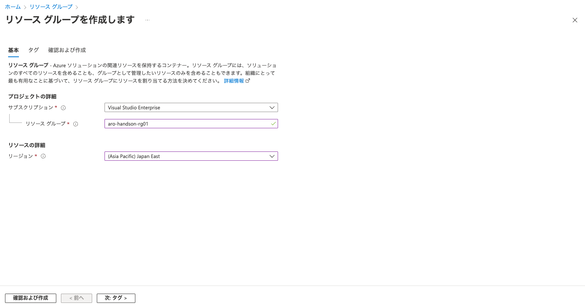
<div style="text-align: center;">リソースグループの作成</div>　　  


ここで作成したリソースグループに対して、サービスプリンシパルを利用したARO作成/削除権限を追加します。作成したリソースグループを選択して、左サイドメニューの「アクセス制御(IAM)」を選択します。これにより、このリソースグループに対する、現時点でのユーザー/サービスプリンシパルに対するロールの割り当て一覧を確認できます。


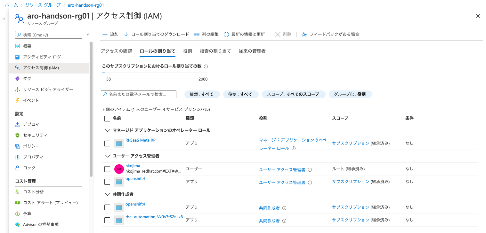
<div style="text-align: center;">リソースグループに対するロールの割り当て一覧</div>　　


AROを作成/削除するための権限となる、カスタムロールを作成します。左上の「+追加」から「カスタムロールの追加」を選択して、任意のカスタムロール名(この例では、aro-access-role)を入力します。ベースラインのアクセス許可は、「最初から始める」を選択して、「次へ」をクリックします。「アクセス許可の追加」をクリックして、「openshift」を検索し、「Azure Red Hat OpenShift」を選択します。そして、権限の全てのチェックボックスにチェックを入れて、「追加」から「確認と作成」をクリックし、最後に「作成」をクリックします。


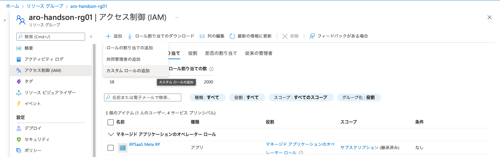
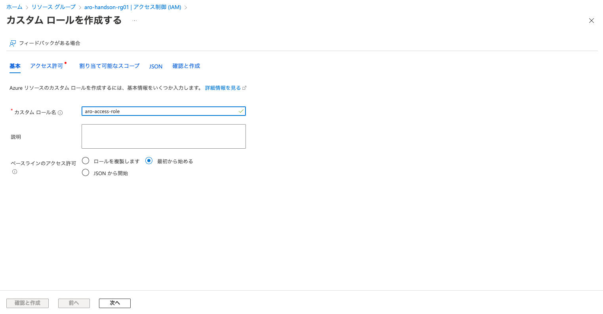
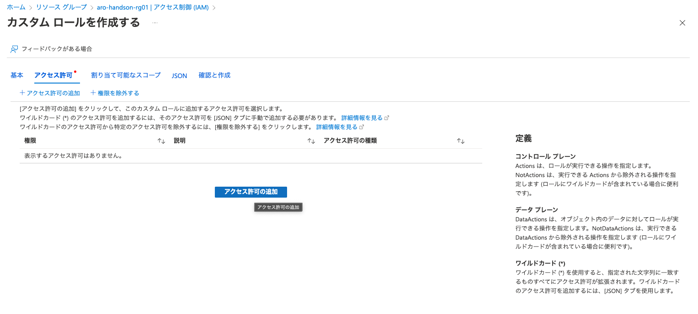
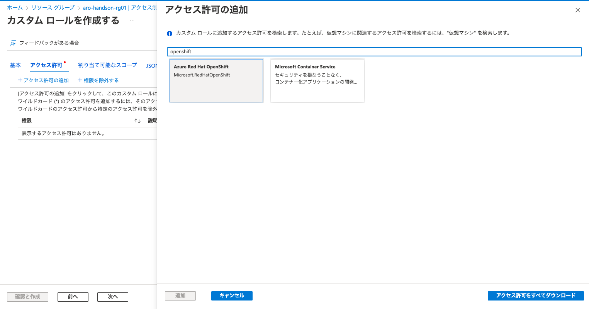
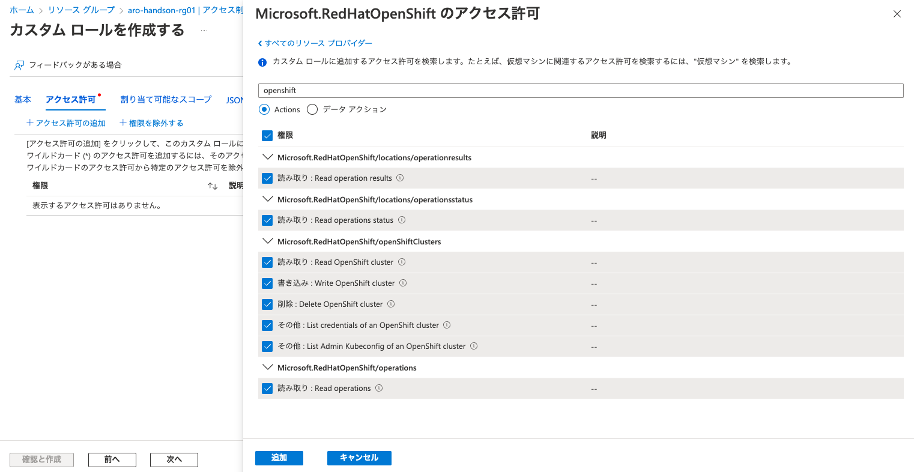
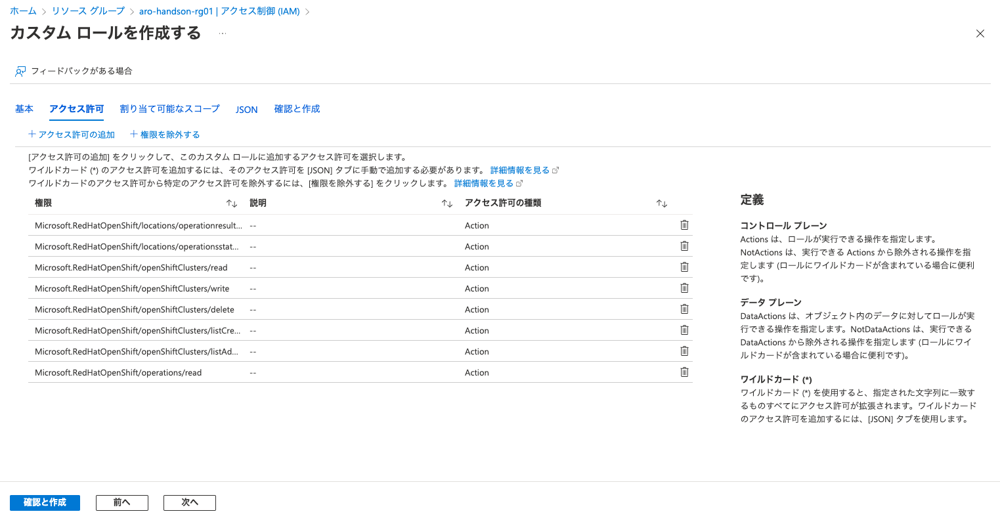
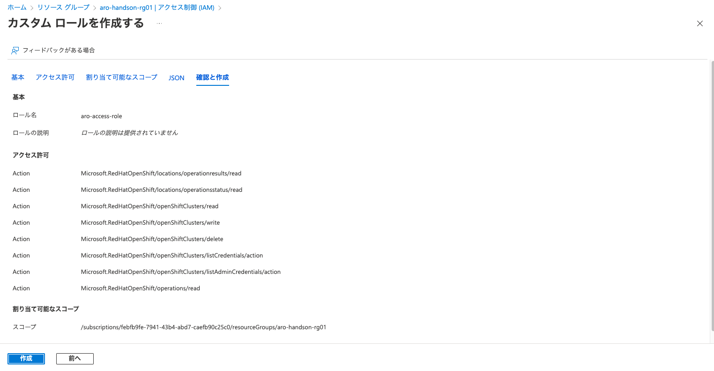
<div style="text-align: center;">カスタムロールの作成</div>　　  


ここで作成したARO作成/削除権限となるカスタムロール(この例では、aro-access-role)と、AROが利用するAzure Virtual Networkの作成/削除権限が含まれるAzureの組み込み(builtin. デフォルトで存在)ロール「ネットワーク共同作成者」を、冒頭で作成したサービスプリンシパルとなるAzureアプリケーションに付与します。


リソースグループの「アクセス制御(IAM)」メニューに戻り、左上の「+追加」から「ロールの割り当ての追加」を選択します。種類で「CustomRole」を選択して、先ほど作成したカスタムロール名(aro-access-role)を選択します。「次へ」をクリックして、アクセスの割り当て先で「ユーザー、グループ、またはサービスプリンシパル」を選択し、「+メンバーを選択する」をクリックします。冒頭で作成したアプリケーション名(aro4)を入力、選択して、「レビューと割り当て」からロールの割り当てを作成します。


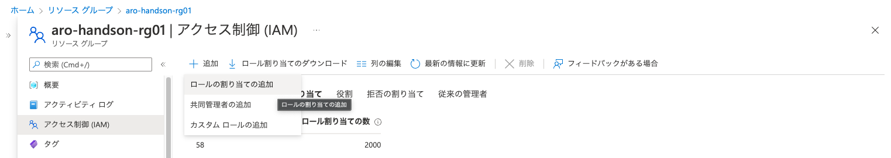
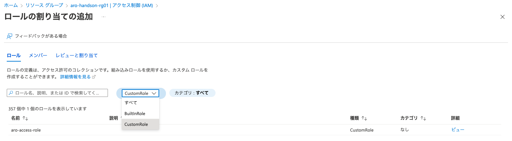
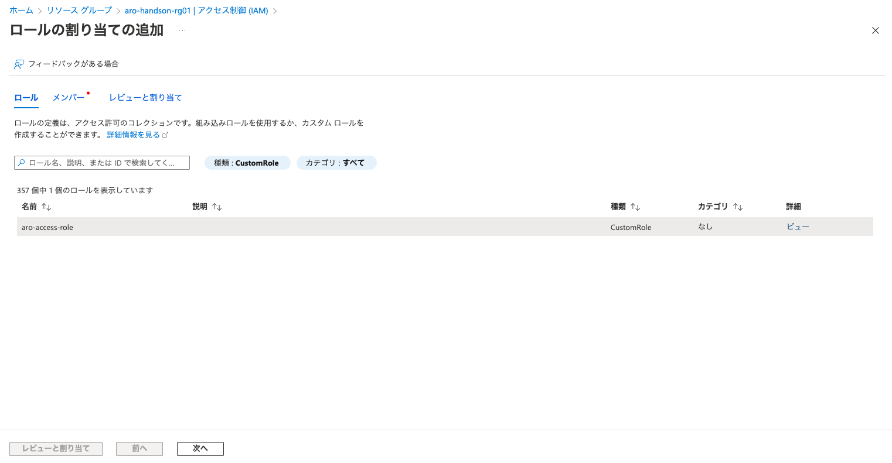
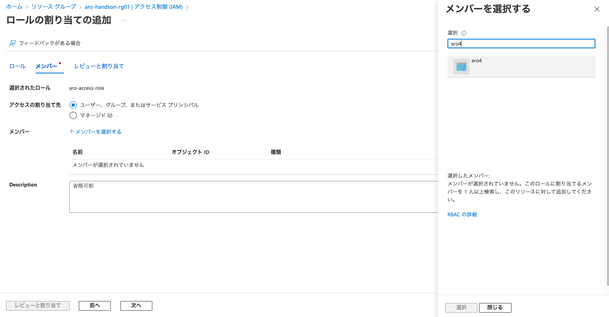
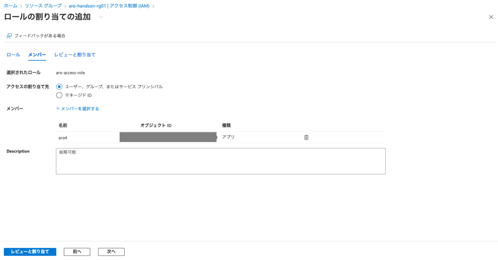
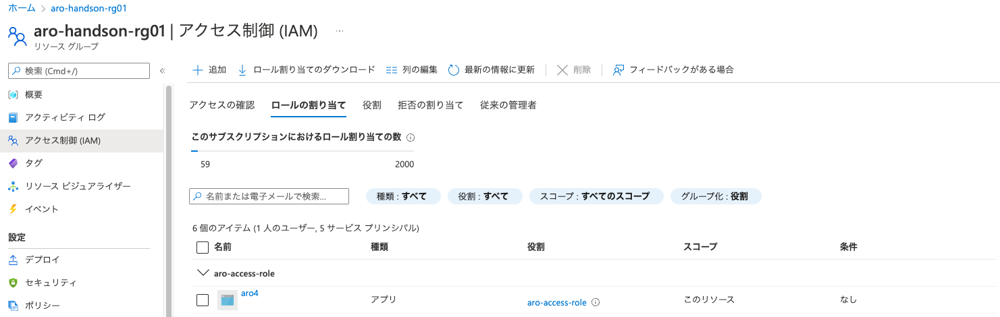
<div style="text-align: center;">AROに関するカスタムロールの割り当て</div>　　  


上記と同様の手順で、今度は組み込みロールの1つである「ネットワーク共同作成者」を割り当てます。「ロールの割り当ての追加」から、種類「BuiltinRole」の一覧にあるロールのうち、「ネットワーク共同作成者」を選択して、サービスプリンシパル(aro4)に割り当てます。すると、次のようなロールの割り当て画面になります。

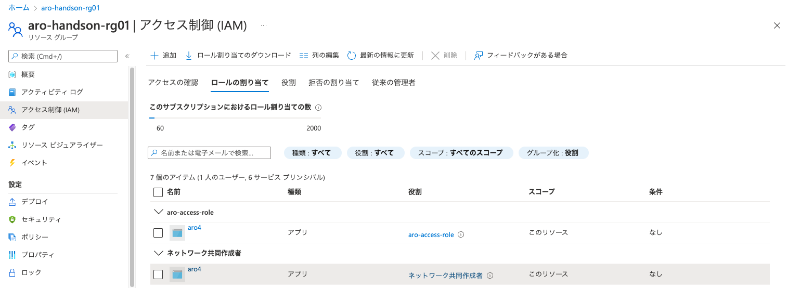
<div style="text-align: center;">AROとVirtual Networkに関する管理権限の割り当て</div>　　  


### AROクラスターの作成

ここまでの手順で、AROクラスターを作成/削除するためのサービスプリンシパルの準備が完了しました。これを利用して、AROクラスターを作成します。Azure Portalのホーム画面にある検索ボックスから「azure red hat openshift」を検索・選択します。「azure red hat openshift の作成」をクリックして、サブスクリプション、前述の手順で作成したリソースグループ、リージョンを選択します。「OpenShift cluster name」と「Domain Name」は任意の名前を入力します。「Worker VM size」と「Worker node count」は、AROクラスターの規模に応じて選択します。この例ではデフォルトの値を利用しています。


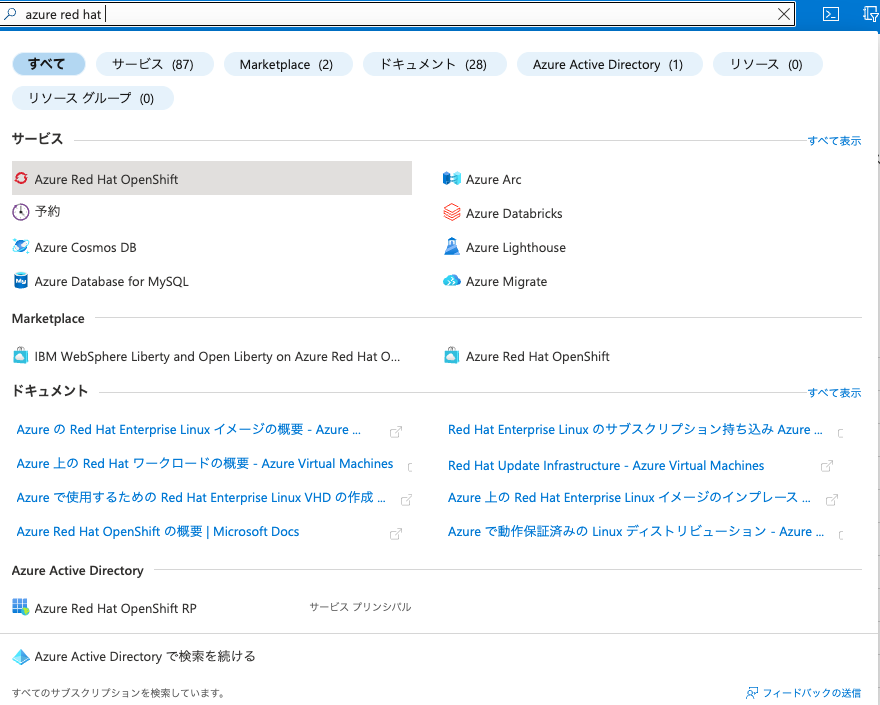
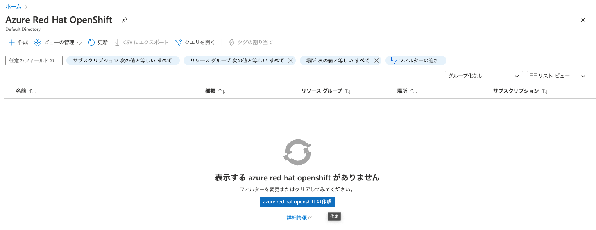

<div style="text-align: center;">AROクラスター作成 その1</div>　　  


**[Tips]** 指定する「Domain Name」については、既存のAROクラスターで使われているドメイン名を指定した場合、AROクラスターの作成中に次のようなメッセージがAzure Portalに表示されて、作成が途中で終了するので、ドメイン名は他と重複しないものを指定する必要があります。

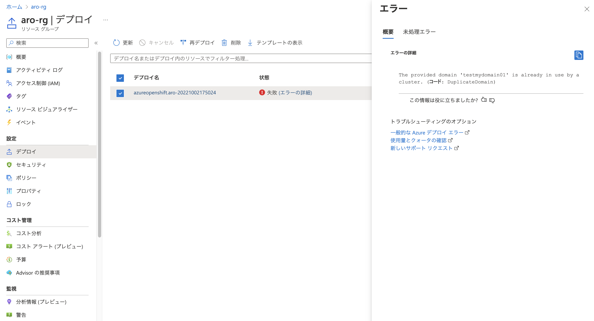
<div style="text-align: center;">AROクラスター作成時のエラーメッセージの例</div>　　  


「次: Authentication >」をクリックして、冒頭で作成してメモしておいた、サービスプリンシパル(aro4)のクライアントID(アプリケーションID)とシークレットの値を入力します。続いて「Red Hat pull secret」に[Red Hat Hybrid Cloud Console](https://console.redhat.com/openshift/install/azure/aro-provisioned)から入手したプルシークレットの値(「Copy pull secret」でコピーが可能)を入力します。このプルシークレットにより、ARO上でレッドハットが提供するOperatorなどのコンテンツを利用できるようになります。「次: Networking >」をクリックして、AROが利用するVirtual Networkの作成画面に移動します。ここでは全てデフォルトの値のまま、「次: Tags >」をクリックして、タグの値は何も入力せずに「確認および作成」から、指定したAROクラスターの構成情報を確認して、「作成」をクリックすることでAROクラスターのデプロイが開始されます。


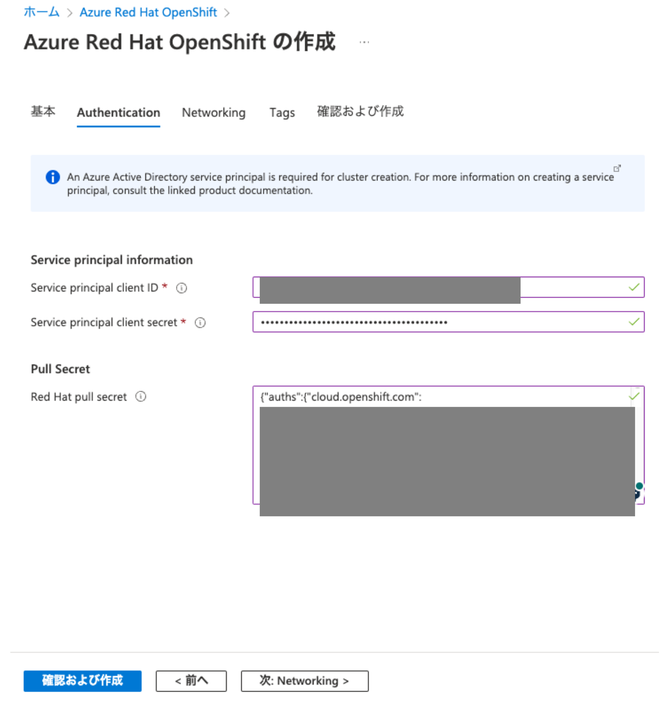

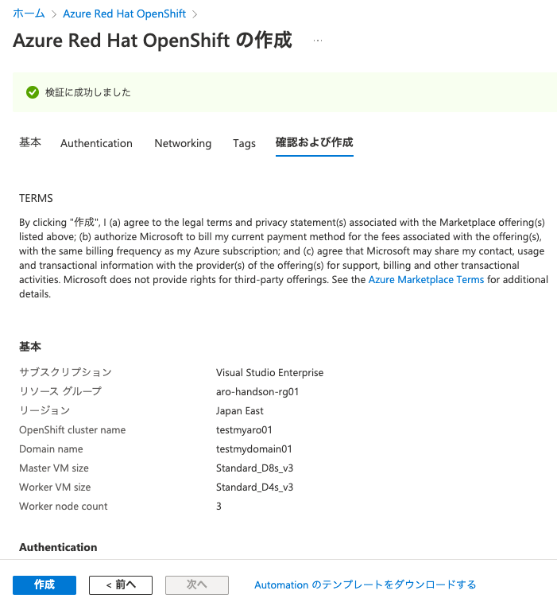
<div style="text-align: center;">AROクラスター作成 その2</div>　　


Azure Portal上でAROクラスターのデプロイ状況を確認できます。デフォルトの構成だと、およそ40分ほどでAROクラスターのデプロイが完了します。

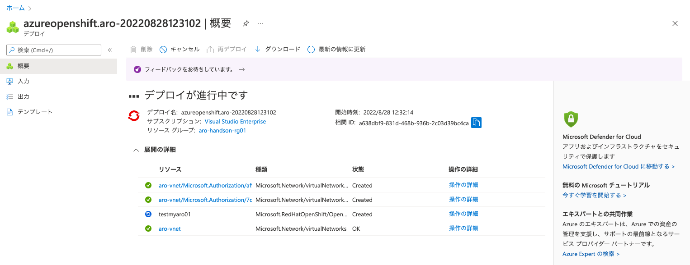
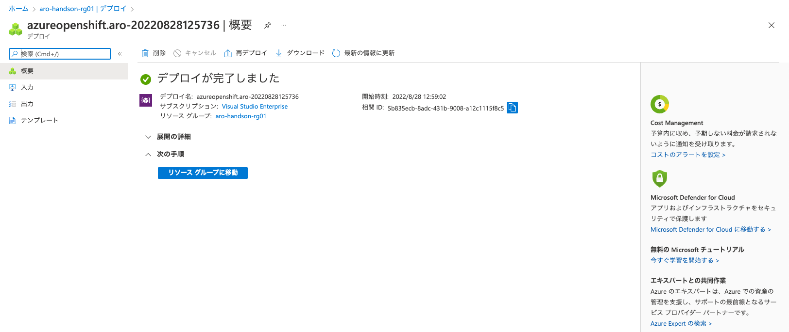
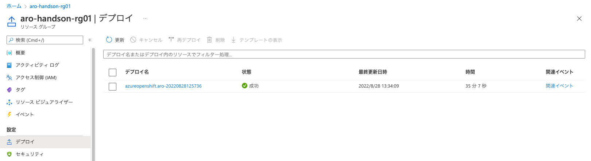
<div style="text-align: center;">AROクラスターのデプロイ状況</div>　　

作成したAROクラスターについては、リソースグループの「概要」メニューから確認できます。作成したAROクラスター名(この例では、testmyaro01)を選択すると、OpenShiftのコンソール/API ServerのURLが確認できます。

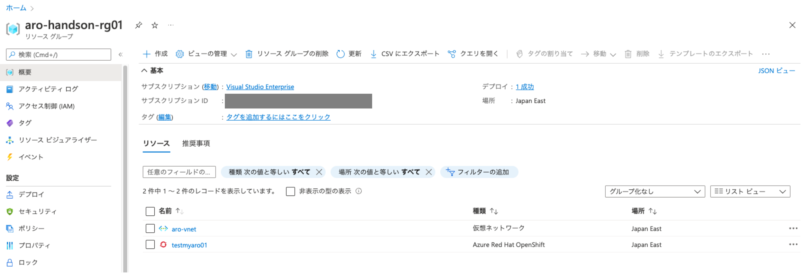
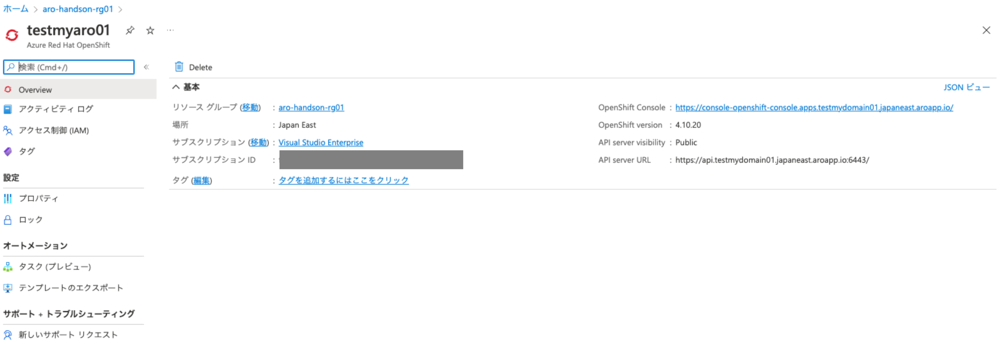
<div style="text-align: center;">AROクラスターのリソース確認</div>　　


OpenShiftコンソールURLにアクセスすると、ログイン画面が表示されます。次のコマンドで確認した、AROクラスターの管理者アカウントでログインできます。azコマンドで指定する`--name`と`--resource-group`オプションは、作成したAROクラスターの名前とリソースグループの名前を指定します。この例では、「testmyaro01」と「aro-handson-rg01」です。

```
$ az login
$ az aro list-credentials --name testmyaro01 --resource-group aro-handson-rg01
```

なお、AROクラスターの作成完了を待っている間、予め作成済みである別のAROクラスターを利用して、受講者は演習を進めます。[アプリケーションのデプロイのクイックスタート](../aro-app-deploy-quickstart)に進んでください。


#### \[参考情報\]

- [Azure portal を使用した Azure Red Hat OpenShift クラスターのデプロイ](https://docs.microsoft.com/ja-jp/azure/openshift/quickstart-portal)
- [Azure Red Hat OpenShiftクラスターを作成(Azure CLIを利用)してWebコンソールからアプリをデプロイ](https://qiita.com/hatasaki/items/8a8526a3dd753e22b503)


[HOME](../../README.md)
