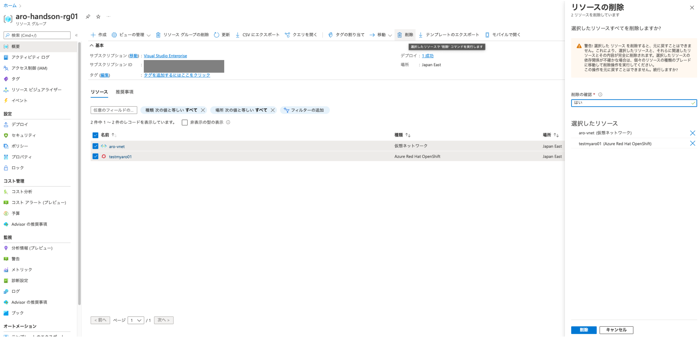
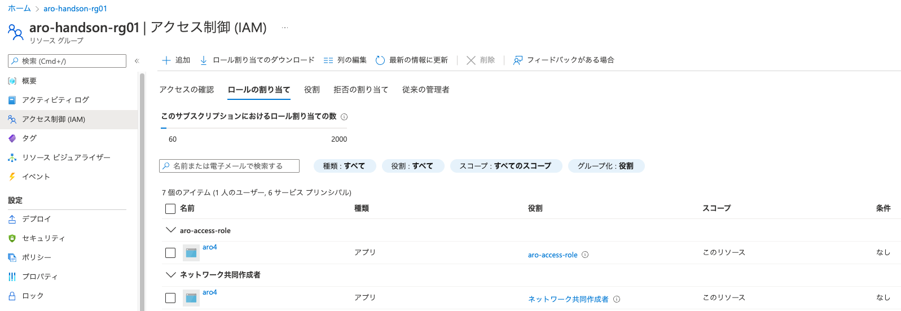

## AROクラスターの削除

### Azure Portalを利用したAROクラスターの削除

Azure Portalにログインして、AROクラスターを作成したリソースグループを選択し、AROとAROが利用する仮想ネットワークを選択して、メニュー右上の「削除」からAROクラスターの削除操作が可能です。デフォルトのAROクラスター最小構成だと、およそ10分~15分ほどで削除が完了します。


<div style="text-align: center;">Azure Portalを利用したAROクラスターの削除</div>　　

### Azure CLIを利用したAROクラスターの削除

Azure CLIを利用したAROクラスターの削除コマンドによる、削除操作が可能です。この例では、リソースグループ「aro-handson-rg01」とAROクラスター名「testmyaro01」を指定して削除コマンドを実行しています。

```
$ az login
$ az aro delete --resource-group aro-handson-rg01 --name testmyaro01
Are you sure you want to perform this operation? (y/n): y
 \ Running ..
```

この場合、AROが利用していた仮想ネットワークは削除されませんので、必要に応じて「az network vnet delete」コマンドで仮想ネットワークを適宜削除してください。

```
$ az network vnet delete --resource-group aro-handson-rg01 --name aro-vnet
 \ Running ..
```

また、AROクラスターデプロイ時に利用した、サービスプリンシパル(この例ではaro4)、カスタムロール(この例ではaro-access-role)、ロールの割り当て、リソースグループ(この例では、aro-handson-rg01)について、今後利用する予定がないのであれば、Azure PortalやAzure CLIで削除して、クリーンアップを完了します。


<div style="text-align: center;">AROクラスターデプロイ時に利用していたアクセス制御のリスト</div>　


これで、AROクラスターの基本的な利用方法を学習する演習とデモ紹介は終了しました。時間に余裕がありましたら、オプションの演習である[AROクラスターでのJavaアプリケーション開発 スターターラボ](../aro-sample-app-develop)に進んでください。


[HOME](../../README.md)
