## AROクラスターのロギングとモニタリング

利用者によるAROクラスターのロギングとモニタリングについては、Azure Monitorの機能の1つである[Container Insights](https://learn.microsoft.com/ja-jp/azure/azure-monitor/containers/container-insights-overview)の利用がMicrosoftによって推奨されています。以下に、Container Insightsについての説明文と紹介画像を抜粋します。


> Container insights により、Kubernetes で使用可能なコントローラー、ノード、およびコンテナーから Metrics API 経由でメモリやプロセッサのメトリックが収集されることで、パフォーマンスを可視化します。 Kubernetes クラスターからの監視を有効化すると、コンテナー化されたバージョンの Linux 向けの Log Analytics エージェントを通じて、メトリックとコンテナー ログが自動的に収集されます。 メトリックは Azure Monitor のメトリック データベースに送信されます。 ログ データは Log Analytics ワークスペースに送信されます。


<div style="text-align: center;">Container Insightsのイメージ</div>

**[上記文章と画像の引用元]** [Container Insights の概要](https://learn.microsoft.com/ja-jp/azure/azure-monitor/containers/container-insights-overview)

Container Insightsがサポートする環境は、Azure Kubernetes Service (AKS)と、AROなどのAzure Arc 対応 Kubernetes クラスターとなります。AROでContainer Insightsの利用を開始するには、Azure Arc 対応 Kubernetes クラスターでContainer Insightsを有効にするための手順を実施します。手順の詳細は、下記のMicrosoftの公式ドキュメントを参考にしてください。

**[参考情報]**
- [コンテナ分析情報を有効にする](https://learn.microsoft.com/ja-jp/azure/azure-monitor/containers/container-insights-onboard)
- [Azure Arc 対応 Kubernetes クラスター用の Azure Monitor Container Insights](https://learn.microsoft.com/ja-jp/azure/azure-monitor/containers/container-insights-enable-arc-enabled-clusters?tabs=create-cli%2Cverify-portal%2Cmigrate-cli)


上記が前提とはなりますが、AROクラスターでは、OpenShiftの標準機能として含まれるロギング機能やモニタリング機能も利用できます。ここでは、モニタリング機能の利用を中心に紹介していきます。


### [ハンズオン] AROクラスターのモニタリング

AROクラスターは、デフォルトでPrometheusをベースとしたモニタリング機能が有効になっています。このモニタリング機能のユースケースは、AROクラスター全体のリソース利用状況を見るものと、AROの利用者が作成したプロジェクト内のリソース利用状況を見るものの2つに別れます。

AROクラスター全体のリソース利用状況のモニタリング、いわゆる「プラットフォームの監視」とMicrosoftの公式ドキュメントで定義しているものについては、MicrosoftとRed HatのSREチームによって利用されています。AROの責任分担マトリクスによって、プラットフォームの監視については、MicrosoftとRed Hatに責任があると定義しているため、AROの利用者はこれらの情報を気にする必要はありません。

後述するコンピュートノードのオートスケール設定が有効になっていない場合、プラットフォームの監視によって得られた情報をもとに、SREチームがAROの利用者に、追加のコンピュートノードやストレージなどのクラスターリソースに必要な変更についてアラートを適宜送信します。

**[参考情報]** [変更管理 の「容量管理」 (Azure Red Hat OpenShift の責任の概要)](https://learn.microsoft.com/ja-jp/azure/openshift/responsibility-matrix#change-management)

AROクラスターでは、プラットフォームのモニタリング機能を提供するPodが、「openshift-monitoring」というプロジェクトで実行されています。

セルフマネージド版のOpenShiftの方では、これに加えて、利用者のプロジェクトのモニタリングに関するカスタム設定(永続ボリュームによる利用者のプロジェクトのメトリクスデータの永続化や、データ保存期間の変更など)を適用するためのPodを、「openshift-user-workload-monitoring」プロジェクトで実行できます。

しかし、現時点のARO 4.10では、この機能をサポートしていません。今後のAROのマイナーリリース(4.11以降)でサポートをする予定です。

「openshift-monitoring」プロジェクトの情報は、AROクラスターの管理者権限を持つユーザーでログインすることで確認できます。

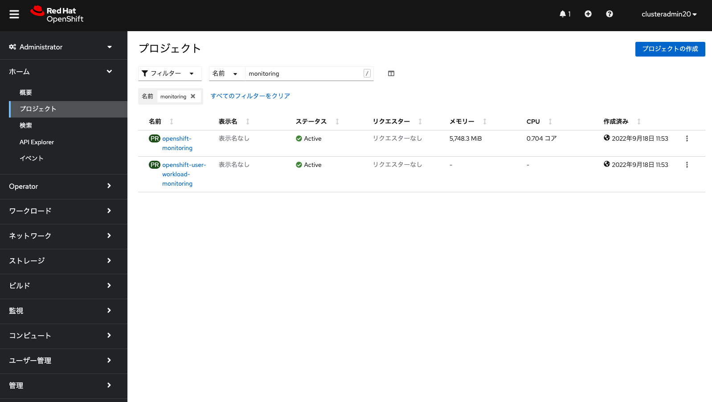
<div style="text-align: center;">モニタリングプロジェクトの一覧</div>　　

「openshift-monitoring」プロジェクトで実行されるPodは、全てのコントローラ/コンピュートノードで実行されるnode-exporter(メトリクス収集に利用)などの一部のPodを除き、大半がコンピュートノード上で実行されるようになっています。

これらのPodを選択して、実行しているノード名に「worker」が含まれている(コンピュートノードを示します)ことを確認してみてください。


<div style="text-align: center;">「openshift-monitoring」プロジェクトのPod</div>　　


この中で、比較的大きなサイズのメモリを使用する「prometheus-k8s」Podも同様に、コンピュートノード上で実行されます。この「prometheus-k8s」Podはレプリカ数が2と定義されており、コンピュートノードの追加/削除に伴ってPodの数は増減しません。

これらのPodはAROクラスターで、デフォルトで実行されるPodであり、[コントローラノードへの移動や変更/削除は許可されていません。](https://learn.microsoft.com/ja-jp/azure/openshift/support-policies-v4)こうした情報を、AROクラスターのサイジングの際に参考にしてください。

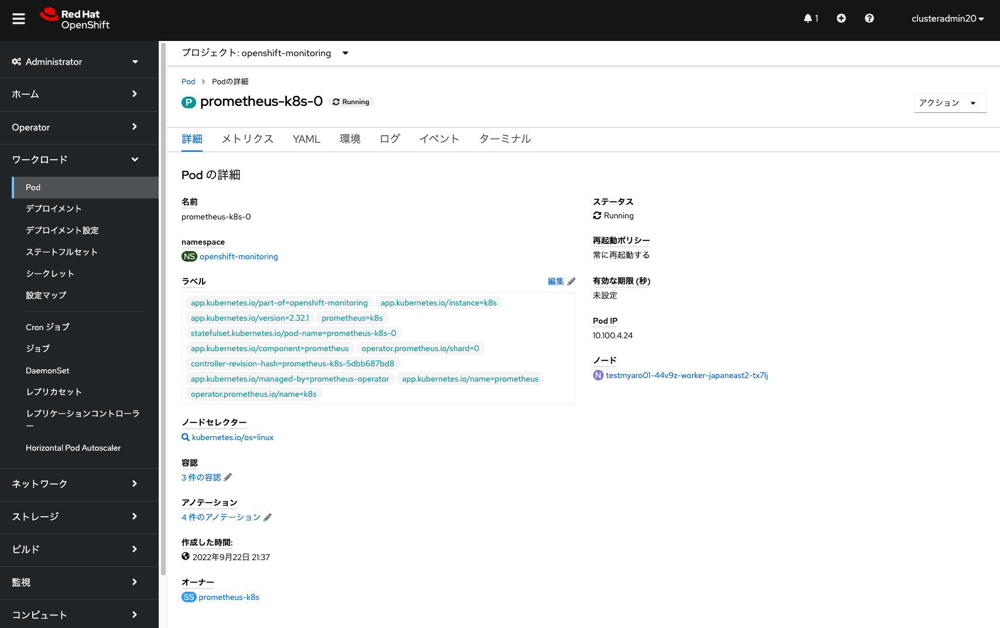
<div style="text-align: center;">「prometheus-k8s」Pod</div>　　

**[参考情報]** [1.2.1. デフォルトのモニターリングコンポーネント](https://access.redhat.com/documentation/ja-jp/openshift_container_platform/4.10/html/monitoring/understanding-the-monitoring-stack_monitoring-overview#default-monitoring-components_monitoring-overview)


AROクラスターのPrometheusでは、メトリクスデータの保存期間は15日間です。また、これらのデータは永続ボリュームによって永続化されておらず、[設定変更も許可されていません。](https://learn.microsoft.com/ja-jp/azure/openshift/support-policies-v4)

そのため、利用者が作成したプロジェクトのメトリクスデータ永続化が必要な場合は、現時点では前述したとおり、Azure Monitorの機能の1つであるContainer Insightsの利用を推奨します。


### [ハンズオン] プロジェクトのメトリクスデータの確認

ここで、実際にメトリクスデータを見てみましょう。Node.jsアプリケーションを作成したプロジェクトを選択して、Developerパースペクティブの左サイドメニューの「監視」をクリックします。すると、CPU使用量/メモリ使用量/送受信帯域幅/送受信パケットレート/送受信パケットドロップレート/ストレージIOに関するグラフデータを確認できます。

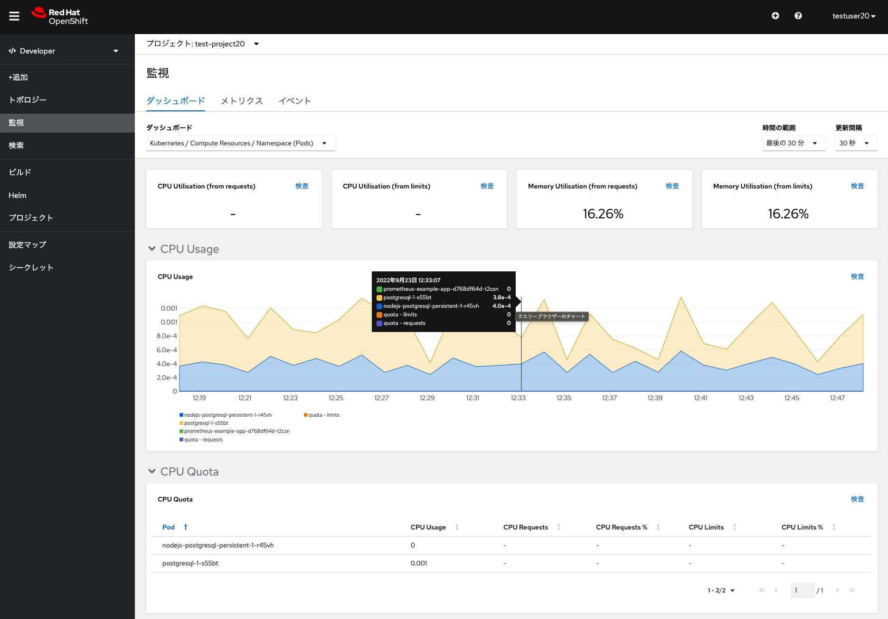
<div style="text-align: center;">プロジェクトのメトリクスデータ</div>　　

PodのCPUとメモリ使用については、「リミット(制限)」と「リクエスト(要求)」という値があり、Pod実行時には、予め定義された「リミット」の中で、「リクエスト」された量を確保しようとします。各コンピュートノードに、「リクエスト」に満たないCPU/メモリリソースしかない場合、AROに内包されるKubernetesのスケジューラによるPod配置は行われません。

「リミット」がない場合、リクエストされた値以上のリソースが使用される可能性があります。また、「リミット」のみ定義されている場合は、リミットに一致する値がリソースとして、スケジューラによってPodに自動的に割り当てられます。

**[参考情報]** [コンテナのリソース管理の「要求と制限」](https://kubernetes.io/ja/docs/concepts/configuration/manage-resources-containers/)を参照

このダッシュボードにある、CPUやメモリの使用率は、これらの「リミット」と「リクエスト」の値に対してどのくらい使用されているか、という情報となります。上記画像の例では、使用率は16.26%となっているため、まだまだリソースに余裕があるということを示しています。

「メトリクス」タブでは、Prometheusのクエリ(PromQL)によるグラフ表示が可能です。予め用意されたクエリ(メモリー使用量など)を用いて、データを確認してみてください。本演習では扱いませんが、カスタムクエリを実施したい場合、[こちらのドキュメント](https://prometheus.io/docs/prometheus/latest/querying/basics/)を参考にできます。

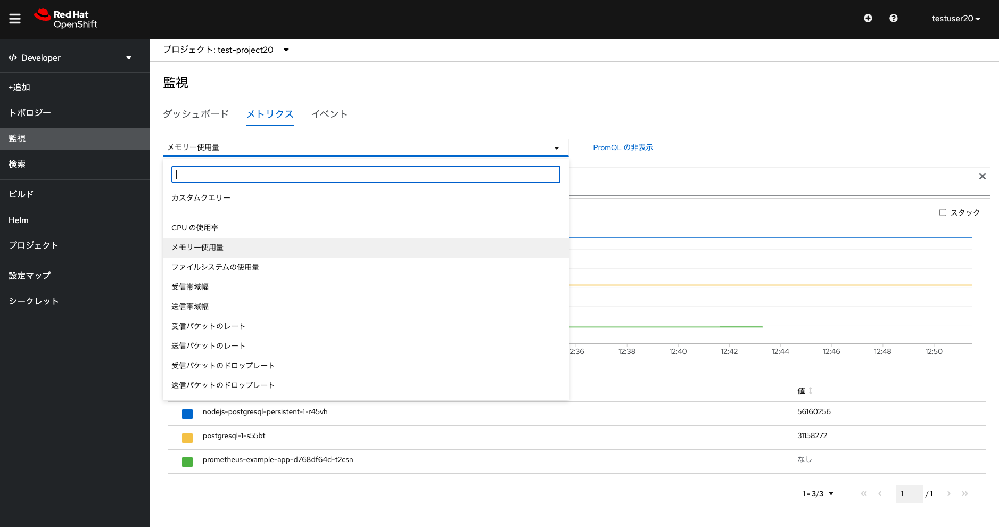
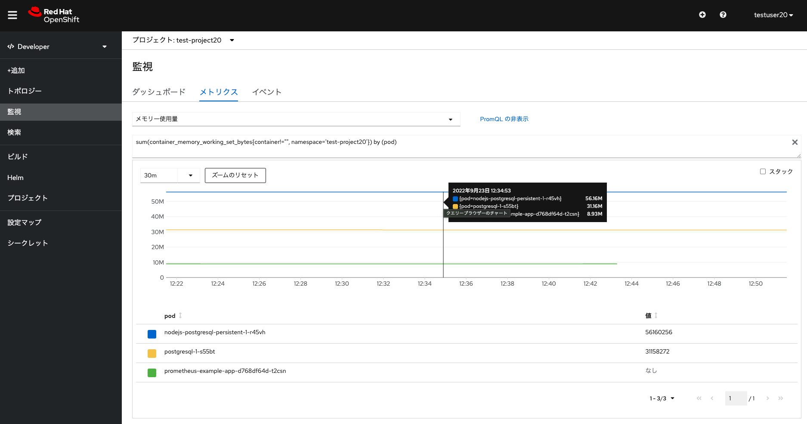
<div style="text-align: center;">Prometheusのクエリ</div>　　


「イベント」タブでは、プロジェクト上の様々な記録を確認できます。PodやPVCなどを作成した際に実行される様々な操作記録(イベント)がストリーミングされていることを確認してみてください。

これらのイベントは、ARO/OpenShiftの様々なクラスター情報を保存する「etcd」データベースに保存されますが、保存期間は「3時間」となります。3時間を過ぎたらetcdデータベースから消去されます。この値は[ハードコーディング](https://github.com/openshift/cluster-kube-apiserver-operator/blob/master/bindata/assets/config/defaultconfig.yaml#L110)されており、AROの利用者が値を変更することはサポートしていません。

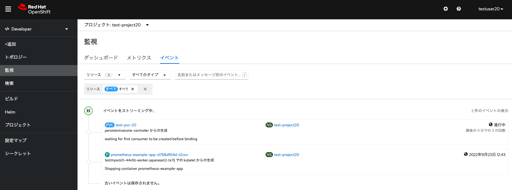
<div style="text-align: center;">ストリーミングされたイベントの例</div>　


### [参考手順] AROクラスターのアラート利用

※ここで紹介している内容は参考手順です。本演習環境用に、アラート送信先となるサンプルメールアドレスやslackチャネルなどは用意していませんので、受講者はコマンド/GUI操作を実施する必要はありません。次の「[参考情報] AROクラスターのロギング」まで読み進めて下さい。

AROクラスターでは、MicrosoftとRed HatのSREチームによって、PrometheusのAlertmanagerによる様々なアラートが利用されています。これは、予め定義しておいた条件式(アラートルール)に一致した場合、アラートが表示されるという仕組みです。

定義されているアラートルールの一覧は、AROクラスターの管理者権限を持つユーザーでログインした後に、Administratorパースペクティブの「アラート」メニューから確認できます。アラートルールには、AROクラスターのOperatorがダウンしているなどのCriticalなアラートから、AROクラスターのUpdateが利用できるといった情報まで、様々なものが定義されています。

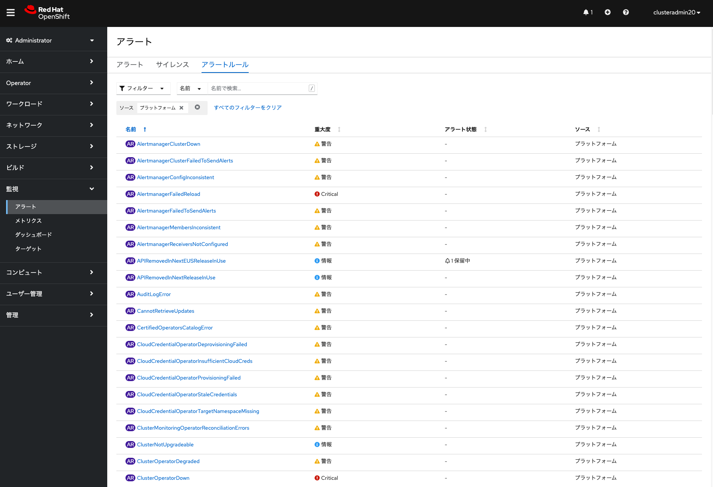
<div style="text-align: center;">アラートルールの一覧</div>　


なお、AROクラスターの[Alertmanagerの設定変更は許可されていません](https://learn.microsoft.com/ja-jp/azure/openshift/support-policies-v4)が、追加のレシーバー(アラート送信先)を設定することはサポートされています。ここでは、アップデート情報に関するアラート送信を想定した設定手順を見ていきましょう。


AROクラスターに管理者権限を持つユーザーでログインして、「ホーム」の「概要」メニューにある「アラートレシーバーの設定」をクリックします。

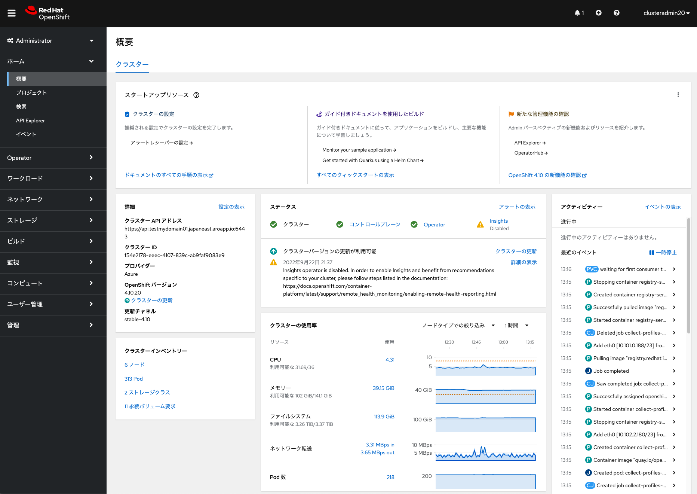
<div style="text-align: center;">AROクラスターの「概要」画面</div>　

すると、次の画面が表示されます。アラートのルーティングにある、各項目の意味は次のとおりです。前述したとおり、Alertmanagerの設定変更は許可されていませんので、デフォルトで使用されているこれらの値を変更することはできません。

なお、Prometheusのアラートでは無駄な通知を防ぐため、類似した性質のアラートを1つにまとめるという[グループ化](https://prometheus.io/docs/alerting/latest/alertmanager/#grouping)の概念があり、これらの項目はグループ化に関連するものとなります。

- `グループ (group_by)`: アラートをグループ化するための条件。AROクラスターでは、namespace(プロジェクト)単位で、発生したアラートをグループ化しています。
- `グループの待機 (group_wait)`: グループ化されたアラートを最初に送信する際の待機時間。この間に発生したアラートは、「group_by」の条件に従ってグループ化されます。Alertmanagerのデフォルト値は30秒となり、AROクラスターもデフォルト値を利用しています。
- `グループの間隔 (group_interval)`: 既に送信済みのアラートと同じグループに所属する新しいアラートが発生した時に、次にアラートを送信するまでの時間。Alertmanagerのデフォルト値は5分となっており、AROクラスターもデフォルト値を利用しています。
- `繰り返し間隔 (repeat_interval)`: すでに送信済みのアラートを再度送信するまでの時間。Alertmanagerのデフォルト値は4時間ですが、AROクラスターでは12時間としています。

これらの項目については、[Prometheusの公式ガイド](https://prometheus.io/docs/alerting/latest/configuration/#route)もご参照ください。

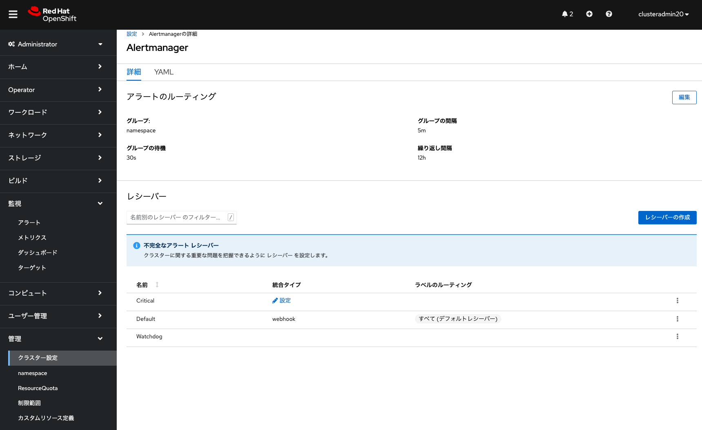
<div style="text-align: center;">Alertmanagerの設定画面</div>　


この設定画面から、アラート送信先となる追加のレシーバーを作成できます。Alertmanagerの設定画面にある「レシーバーの作成」をクリックして、アラート送信先となる情報を入力します。

下記画像は、Gmailを使う時の例ですが、他にもPagerDuty/Webhook/Slackが、アラート送信先として指定できます。レシーバー名には、重複しない範囲で任意の名前(この例では、test-receiver20)を使用できます。

ラベルのルーティングでは、このラベル値に一致するアラートが設定した宛先に送信されます。この例では、名前に「alertname」、値に「UpdateAvailable」を指定します。入力が完了したら「作成」をクリックして、レシーバーを作成します。

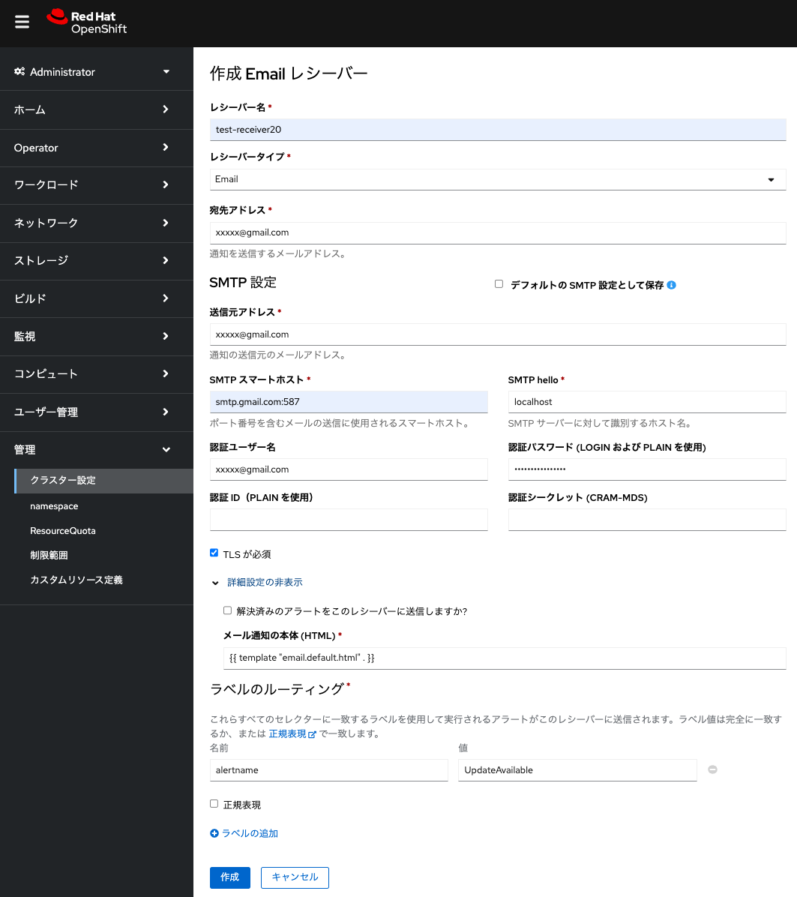
<div style="text-align: center;">レシーバーの作成画面</div>　

ここでアラートが自動的に送信されるのを待ってもいいのですが、アラート送信テスト間隔を早めたい場合は、先ほど設定したAlertmanagerのレシーバー「test-receiver20」をYAMLファイルで直接編集します。

Alertmanagerの「YAML」タブをクリックして、末尾を以下のように編集します。設定したレシーバーに対するグループの間隔と繰り返し間隔を1分間に設定することで、発生したアラートを1分置きに指定した宛先に送信するようになります。

```
...<略>...
- receiver: test-receiver20
  match:
    alertname: UpdateAvailable
  group_interval: 1m
  repeat_interval: 1m
```

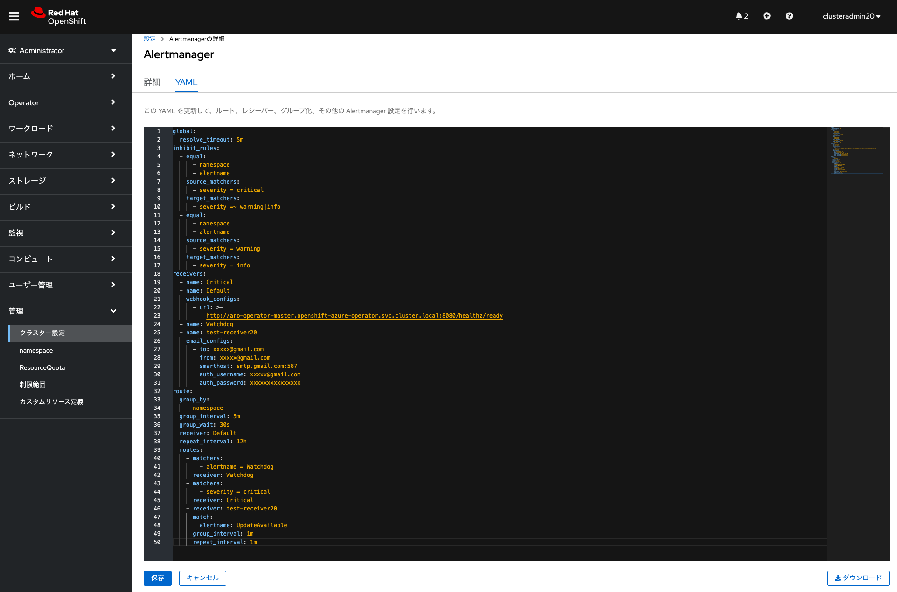
<div style="text-align: center;">レシーバーの編集画面</div>　


この設定が完了すると、1分後くらいに、OpenShiftのWebコンソールで発生しているアラートが、指定した宛先に届いていることを確認できます。下記の画像は、OpenShiftコンソールにあるアラート例と、Gmailに届いたアラートメールの例です。アラート名が「UpdateAvailable」であるアラートは、現在のAROクラスターに対して、新しいアップデートが利用可能という情報を紹介したアラートとなります。

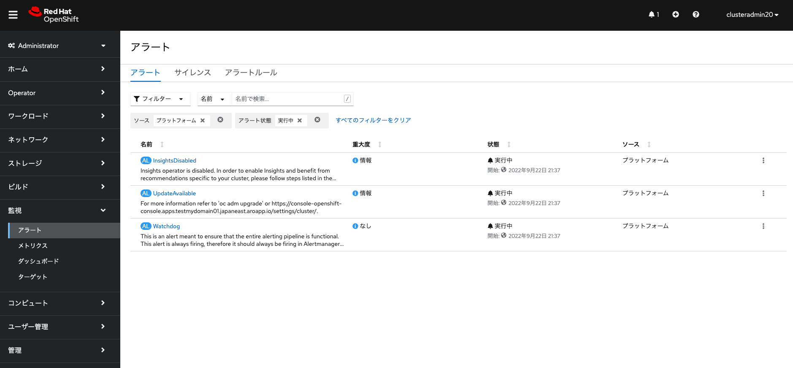
<div style="text-align: center;">OpenShiftコンソールのアラート例</div>　

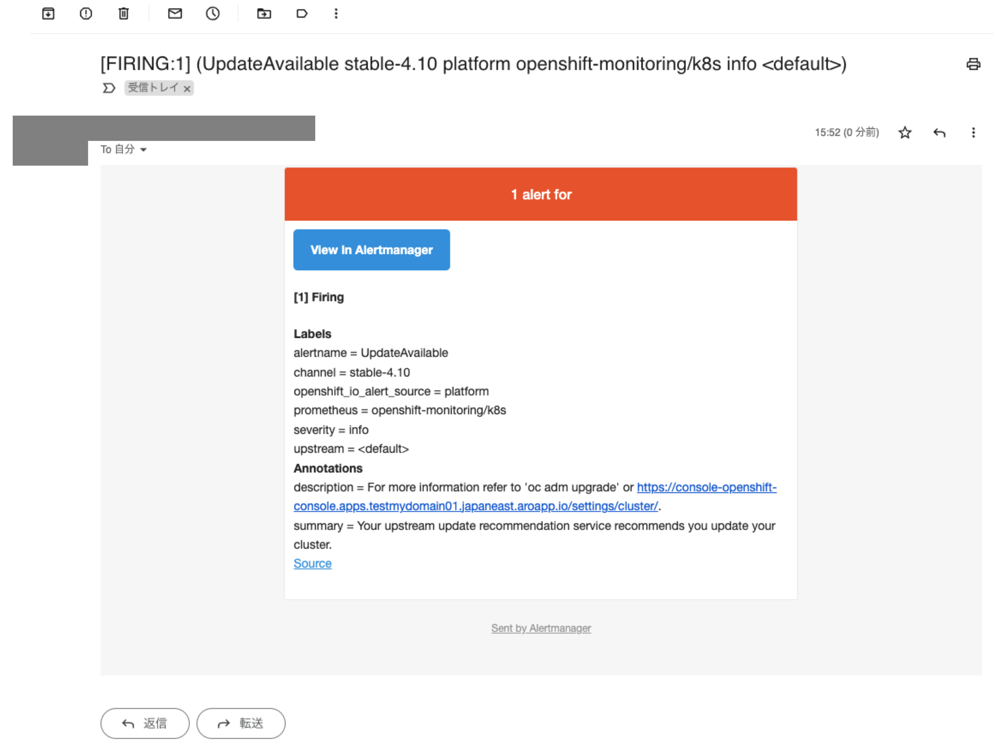
<div style="text-align: center;">Gmailに届いたアラートメールの例</div>　

後述する手順でAROクラスターのアップグレードを実行した場合、この「UpdateAvailable」アラートの状態が解決済み(アラートの「state」が、「firing」から「resolved」に変更)となり、アラートが自動的に消去されます。

上記のレシーバーの作成画面にあります「解決済みのアラートをこのレシーバーに送信しますか？」にチェックを入れておくと、この「解決済み」アラートも自動送信されます。

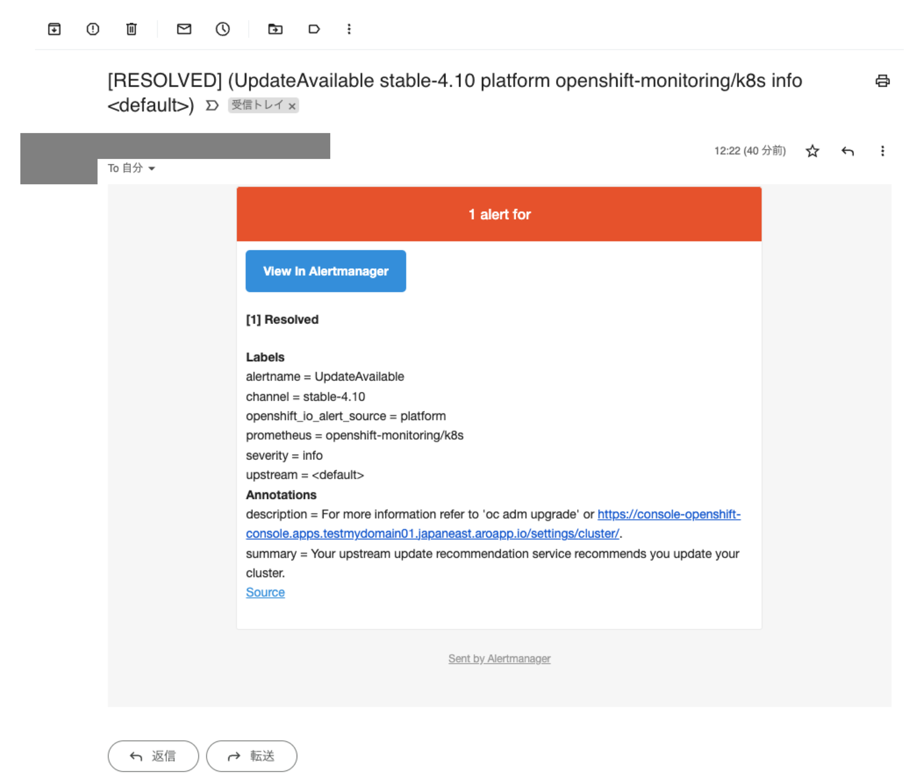
<div style="text-align: center;">Gmailに届いた解決済みアラートメールの例</div>　


ちなみに、こうしたシステムの状態変更などに伴い、アラート発生後に一定時間同じアラートが発生しなかった場合には、アラートが自動的に「解決済み」の状態になって消去されます。この「一定時間」については、Alertmanagerでは「[resolve_timeout](https://prometheus.io/docs/alerting/latest/configuration/#configuration-file)」で設定されており、AROクラスターではデフォルト値の「5分」を利用しています。


利用者が追加したレシーバーは、不要になれば削除できます。作成したレシーバー名の右横にある「・」が縦に3つ並んだアイコンをクリックして、「レシーバーの削除」から削除できます。

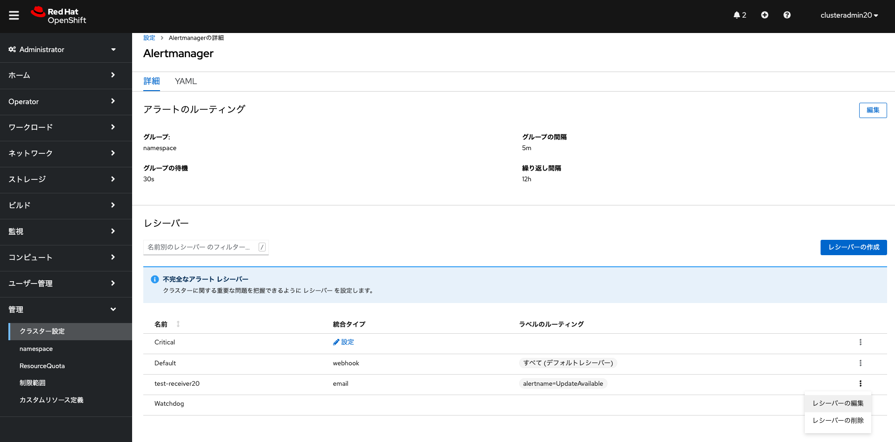
<div style="text-align: center;">レシーバーの削除</div>　


### [参考情報] AROクラスターのロギング

※こちらは参考情報です。読み進めていただき、読み終わりましたら、次の演習に進んでください。

AROクラスターでは、MicrosoftとRed HatのSREチームがロギングサービスとして利用している[Azure Linux monitoring agent (mdsd)](https://github.com/Azure/fluentd-plugin-mdsd) Podが実行されています。このPodは、「openshift-azure-logging」プロジェクトで実行され、全てのコントローラ/コンピュートノードで実行されます。

AROクラスターの利用者がコンピュートノードを追加/削除した場合、それに伴って、mdsd Podも自動的に追加/削除されます。AROクラスターの利用者が、[mdsd Podを変更/削除することは許可されていません。](https://learn.microsoft.com/ja-jp/azure/openshift/support-policies-v4)

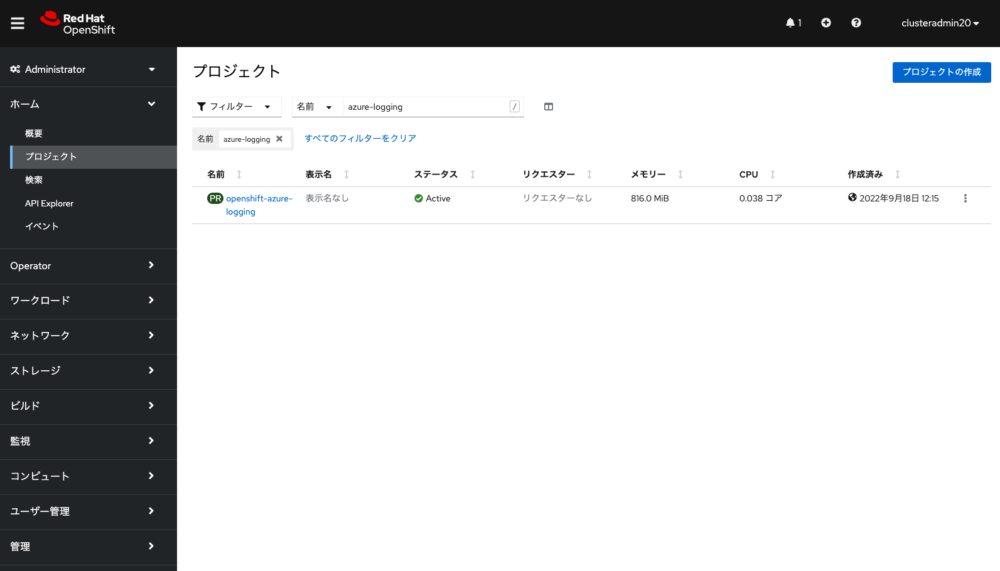
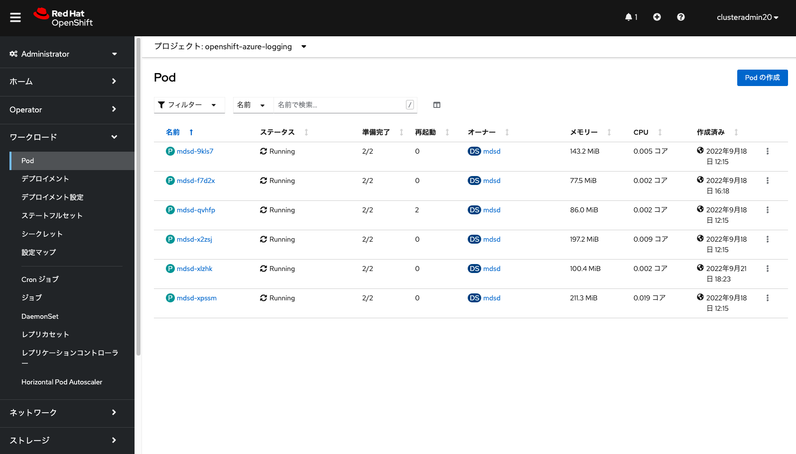
<div style="text-align: center;">mdsdの実行状態に関する情報</div>　　


これとは別に、AROクラスターの利用者がOpenShift標準のロギング機能を導入して利用することもできます。OpenShiftでは、Lokiを使ったロギングサブシステムが標準となっています。以前のOpenShiftではElasticsearchを利用していましたが、[最新版のOpenShiftでは非推奨](https://access.redhat.com/documentation/ja-jp/openshift_container_platform/4.11/html/logging/cluster-logging-release-notes-5-4-3)になっており、今後削除される予定です。

本演習では扱いませんが、Lokiを使ったロギングサブシステムのデプロイ手順は、下記の「参考情報 第5章 Loki」を参考にしてください。Lokiのロギングサブシステムをデプロイすることで、AROクラスターの利用者が、次のログを収集してOpenShiftのWebコンソールから確認できるようになります。

- `アプリケーションログ`: 利用者が作成したプロジェクトにデプロイされるアプリケーションのログ(stdoutとstderrに出力されるログ)を収集します。後述のインフラストラクチャー関連のログは除きます。
- `インフラストラクチャーログ`: AROクラスター作成時にデフォルトで作成される`openshift-*`,`kube-*`などのプロジェクトにある、インフラストラクチャー関連のログを収集します。
- `セキュリティ監査ログ`: ノード監査システム(auditd)で生成されるログ(/var/log/audit/audit.log)、Kubernetes apiserver、OpenShift apiserverの監査ログを収集します。通常、AROクラスターの監査ログは、MicroSoftとRed HatのSREチームによって管理され、[問題調査の際に、AROの利用者のサポートケースを使用したリクエストに伴って提供](https://learn.microsoft.com/ja-jp/azure/openshift/responsibility-matrix#change-management)されます。そのため、AROの利用者はこれらのログを保存する必要は必ずしもありませんが、Lokiを利用することで、利用者も随時確認できるようになります。

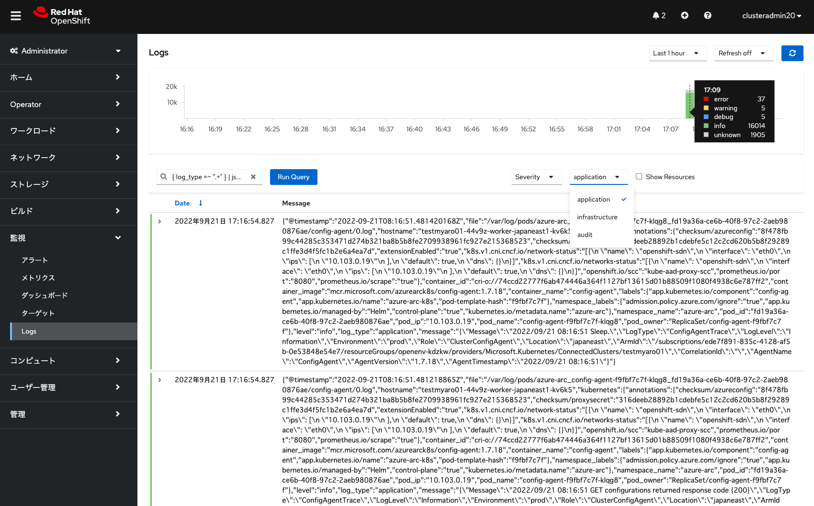
<div style="text-align: center;">AROクラスター上のアプリケーションのログ確認</div>　　


**[参考情報]** [第5章 Loki](https://access.redhat.com/documentation/ja-jp/openshift_container_platform/4.11/html/logging/cluster-logging-loki)

AROでLokiのロギングサブシステムをデプロイする場合、コントローラ/コンピュートノードのメトリクス収集(Lokiでは、collectorという名前のPodが該当。前述のmdsd Podとは別に、独立して動きます)に利用するものを除き、全てコンピュートノードで実行されます。

これらのPodを、[コントローラノードで実行することは許可されていません。](https://learn.microsoft.com/ja-jp/azure/openshift/support-policies-v4)どのくらいのリソースが必要になるかは、上記ドキュメントの「第5章 Loki」に記載しているので、そちらをサイジングの目安にしてください。


これで、AROクラスターのロギングとモニタリングに関する演習は終了です。次の演習の[コンピュートノードの追加/削除とオートスケールの設定](../aro-nodes)に進んでください。

[HOME](../../README.md)
