## コンピュートノードの追加/削除とオートスケールの設定

##### ※ 本演習環境で用意したリソースの上限値(コンピュートノードの追加が20台まで)を定義しているため、この演習内容を同時に実施できるのは受講者10人までという制約があります。同時実施人数が10人を超える場合、コンピュートノードの追加/削除/編集作業の実施のみ(コンピュートノードの追加作業を実行して、実際に追加される前に削除作業を実施するなどの作業をする)、または、インストラクターによるデモ/説明のみとなりますので、予めご了承ください。

### マシンセットの新規作成によるコンピュートノードの追加

実行するアプリケーションの数が多くなり、コンピュートノードのリソース(CPUやメモリ)使用率が逼迫した場合、OpenShiftのコンソールからコンピュートノードを追加・削除できます。
AROに含まれるOpenShiftのコンピュートノードは、マシンセット(machinset)というリソース単位で管理されており、新規にコンピュートノードを追加・削除する場合、このマシンセットを作成・編集・削除します。

ここでインストラクターから共有された管理ユーザアカウントを使って、AROクラスターにログインし直します。以降の演習は、この管理ユーザアカウントを利用します。

デフォルトで用意されているマシンセットは、Administratorパースペクティブの「マシンセット」メニューから確認できます。Japan EastリージョンにあるAROを利用している場合、デフォルトで3つのアベイラビリティーゾーンに対応したマシンセットが1つずつ存在します。これらのマシンセットの中に1台ずつコンピュートノードが含まれています。


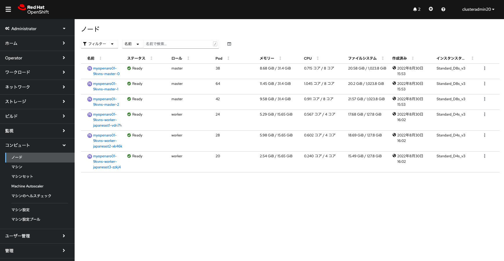
<div style="text-align: center;">マシンセットとノードの確認</div>　


デフォルトで用意されているマシンセットのうち、いずれかを選択して、「必要なカウント」にあるマシン台数を編集することでコンピュートノードを簡単に追加・削除できるようになっています。しかし、この演習では、デフォルトで用意されているマシンセットは編集せずに、新しくマシンセットを追加することで、コンピュートノードを追加してみます。

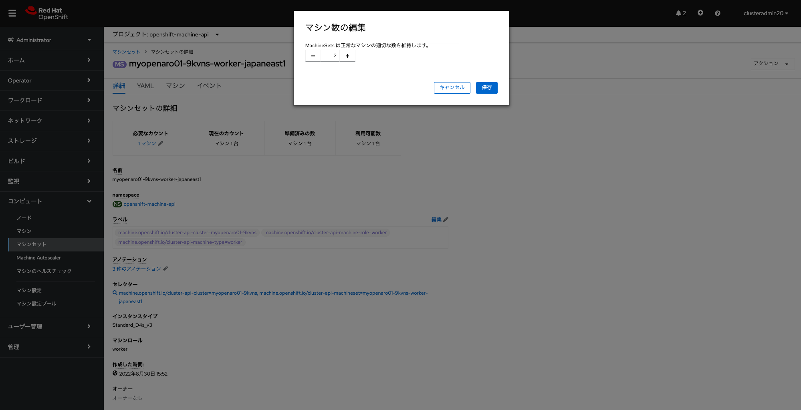
<div style="text-align: center;">マシンセットの編集によるコンピュートノードの台数指定 (※この演習では、デフォルトで用意されているマシンセットは編集しません)</div>　


最初にAdministratorパースペクティブの左サイドメニューからマシンセットを選択して、「マシンセットの作成」ボタンをクリックします。すると、YAMLファイルを入力する画面が表示されますので、下記のようなマシンセットを定義したYAMLファイルを入力し、「作成」をクリックしてマシンセットを作成します。新規マシンセットの作成に伴い、自動的にコンピュートノードが1台(replicas: 1の指定によるもの)追加されます。

```
apiVersion: machine.openshift.io/v1beta1
kind: MachineSet
metadata:
  name: <マシンセット名>
  labels:
    machine.openshift.io/cluster-api-cluster: <AROクラスター名>
    machine.openshift.io/cluster-api-machine-role: worker
    machine.openshift.io/cluster-api-machine-type: worker
  namespace: openshift-machine-api
spec:
  replicas: 1
  selector:
    matchLabels:
      machine.openshift.io/cluster-api-cluster: <AROクラスター名>
      machine.openshift.io/cluster-api-machineset: <マシンセット名>
  template:
    metadata:
      labels:
        machine.openshift.io/cluster-api-cluster: <AROクラスター名>
        machine.openshift.io/cluster-api-machine-role: worker
        machine.openshift.io/cluster-api-machine-type: worker
        machine.openshift.io/cluster-api-machineset: <マシンセット名>
    spec:
      metadata:
        labels:
          <key>: <value>
      providerSpec:
        value:
          location: japaneast
          networkResourceGroup: <ネットワークリソースグループ名>
          publicLoadBalancer: <AROクラスター名>
          resourceGroup: <AROクラスターのドメイン名>
          vnet: <Virutal Network名>
          vmSize: Standard_F4s_v2
          zone: "3"
          image:
            offer: aro4
            publisher: azureopenshift
            resourceID: ""
            sku: aro_410
            version: 410.84.20220125
          apiVersion: machine.openshift.io/v1beta1
          credentialsSecret:
            name: azure-cloud-credentials
            namespace: openshift-machine-api
          kind: AzureMachineProviderSpec
          metadata:
            creationTimestamp: null
          userDataSecret:
            name: worker-user-data
          osDisk:
            diskSettings: {}
            diskSizeGB: 128
            managedDisk:
              storageAccountType: Premium_LRS
            osType: Linux
          publicIP: false
          subnet: worker
```

こうしたマシンセットを新規作成する場合は、既存のマシンセットをコピーして値を変更すると便利です。「<>」で囲んだところは、AROクラスターの環境に応じて適宜変更します。具体的な変更内容については、当日インストラクターから案内されますが、それぞれの変数と説明は次のとおりです。

- マシンセット名: 任意に指定可能なマシンセット名。下記画像の例では、「myopenaro01-9kvns-hkojima-worker-japaneast3」を指定
- AROクラスター名: マシンセットで参照されるAROクラスターの名前。下記画像の例では、「myopenaro01-9kvns」を指定
- key, value: マシンセットで指定する任意のラベル名。下記画像の例では、「key」に「type」を、「value」に「hkojima-worker-nodes」を指定 (このラベルは後に使いますので、他の受講者と被らないようなラベルを付けて下さい)
- ネットワークリソースグループ名: AROが利用するVirtual Networkリソースがあるリソースグループ名。下記画像の例では、「openenv-hkctf」を指定
- AROクラスターのドメイン名: マシンセットで参照されるAROクラスターのドメイン名。下記画像の例では、「aro-myopendomain01」を指定
- Virutal Network名: AROクラスターが利用するVirtual Network名。下記画像の例では、「myopenaro-vnet01」を指定

これらの変数を設定した、[マシンセットのサンプルファイル](./aro-machineset-japaneast3.yaml)がありますので参考にしてください。なお、「vmSize: Standard_F4s_v2」で[AROで利用可能な最小サイズのコンピュートノード](https://docs.microsoft.com/ja-jp/azure/openshift/support-policies-v4#supported-virtual-machine-sizes)を指定し、「zone: "3"」で3番目のアベイラビリティーゾーンを指定しています。


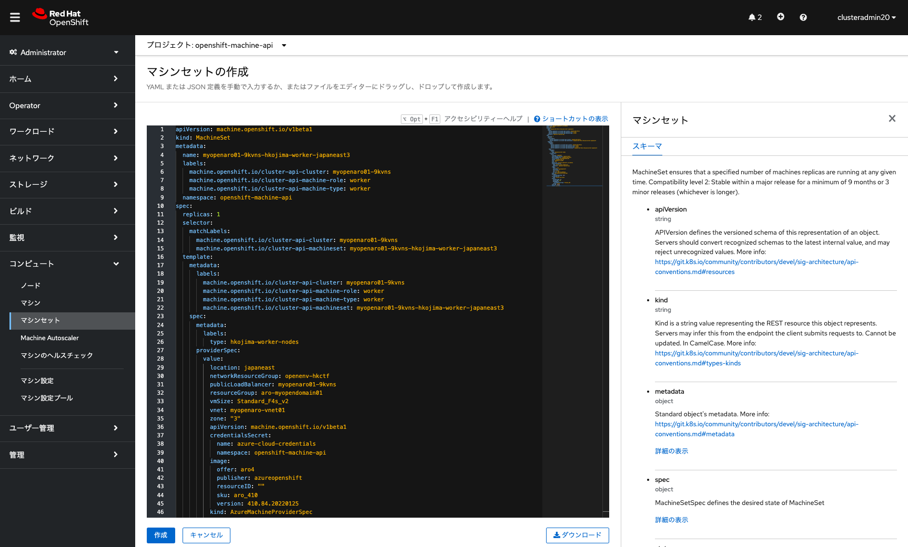
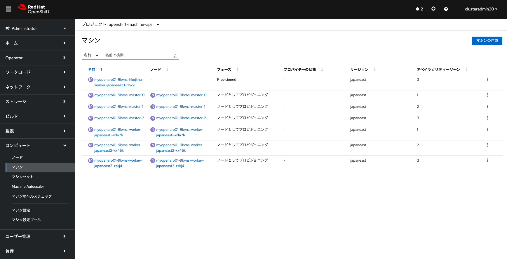

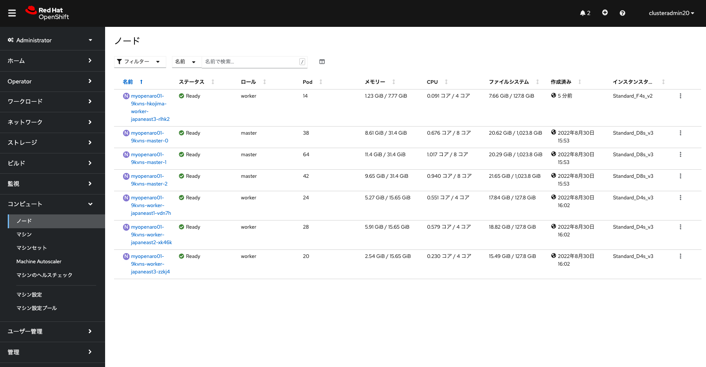
<div style="text-align: center;">マシンセットの作成</div>　

マシンセットの作成に伴い、対応したコンピュートノードに、前述したマシンセット作成時に指定したラベル(この例では、「type=hkojima-worker-nodes」)が自動的に付与されます。このラベルを利用して、Podを特定のラベルが付いたコンピュートノードで実行できるようになります。なお、マシンセットやマシン(各ノードに対応した情報(インスタンスタイプなど)が記述されるOpenShiftのリソース. マシンのグループがマシンセット)自体には、ラベルは付与されません。

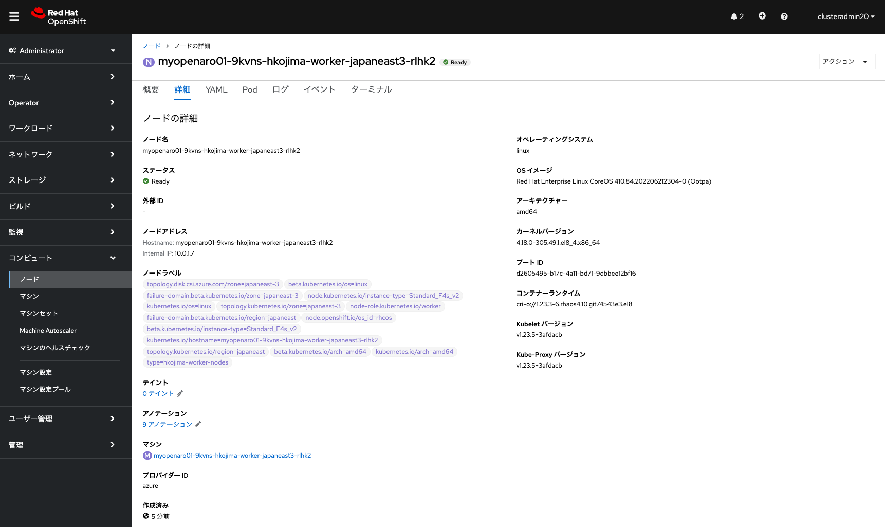
<div style="text-align: center;">コンピュートノードのラベル確認</div>　


### オートスケールの設定

AROで提供するOpenShiftのオートスケールを設定するには、次の2つの設定が必要になります。

- Cluster Autoscaler: クラスター全体のオートスケールの設定。クラスター全体のコントローラおよびコンピュートノードの上限値、CPU/メモリの最小/最大値などを設定
- Machine Autoscaler: マシンセットに対するオートスケールの設定。最小台数と最大台数を設定

Cluster Autoscalerは、次のYAMLファイルを利用して、OpenShiftのWebコンソールから設定できます。なお、今回の環境では予めインストラクターによってCluster Autoscalerが設定されているため、受講者はCluster Autoscalerを設定する必要はありません。

```
apiVersion: "autoscaling.openshift.io/v1"
kind: "ClusterAutoscaler"
metadata:
  name: "default"
spec:
  podPriorityThreshold: -10
  resourceLimits:
    maxNodesTotal: 50
    cores:
      min: 8
      max: 512
    memory:
      min: 4
      max: 1024
  scaleDown:
    enabled: true
    unneededTime: 6m
    delayAfterAdd: 2m
    delayAfterDelete: 1m
    delayAfterFailure: 15s
```

この例では、最大50台までノードをデプロイ可能で、オートスケールダウンも設定し、不要なノードが削除対象になるまでの時間を6分間と指定しています。その他のパラメータの説明については、[こちらのドキュメント](https://access.redhat.com/documentation/ja-jp/openshift_container_platform/4.11/html/machine_management/configuring-clusterautoscaler)もご参照ください。

Cluster Autoscalerは、Adminisratorパースペクティブの「クラスター設定」メニューから、「Autoscaler の作成」をクリックすることで、設定を作成できます。Cluster Autoscalerの名前は、「default」を指定する必要があるので注意してください。

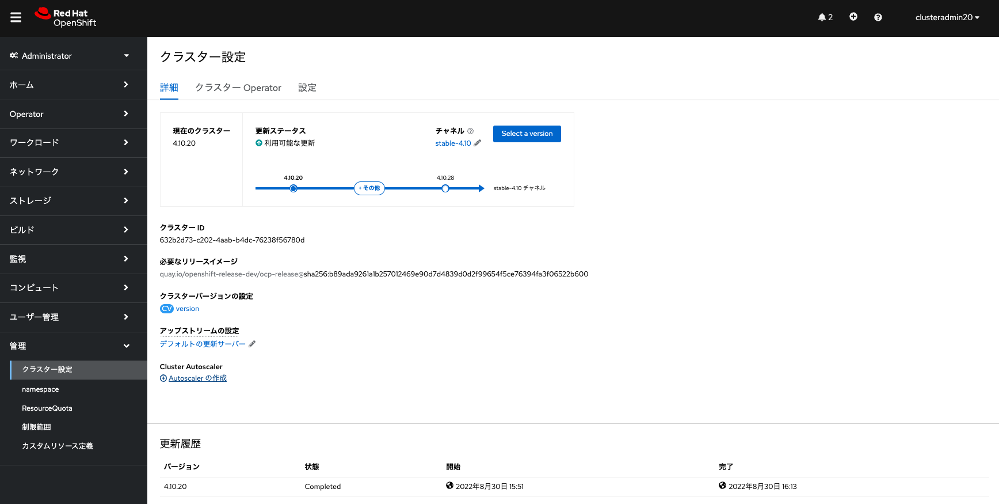
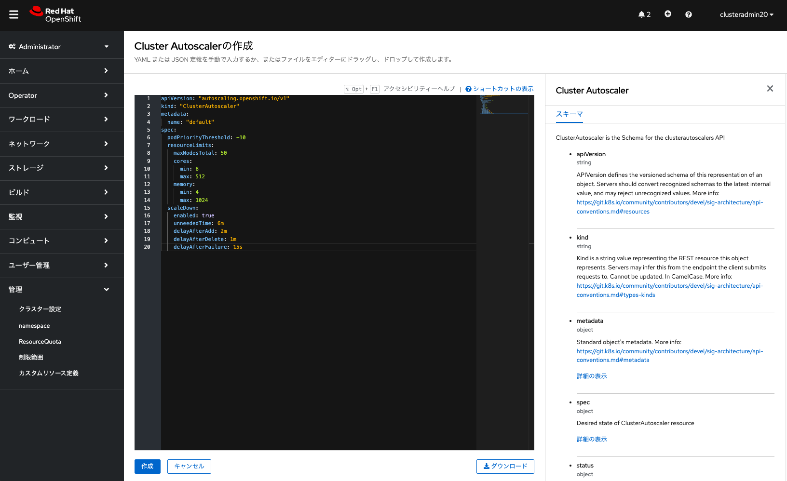

<div style="text-align: center;">Cluster Autoscalerの設定(※この演習では、インストラクターによって設定済み)</div>　


続いて、Machine Autoscalerの設定です。これは前述した手順で受講者が作成したマシンセットの右側にある「・」が縦に3つ並んだアイコンをクリックして、「Machine Autoscalerの作成」をクリックし、最小数と最大数を設定して「作成」ボタンをクリックするだけで設定できます。今回の演習では、最小数を「1」、最大数を「2」と設定してください。

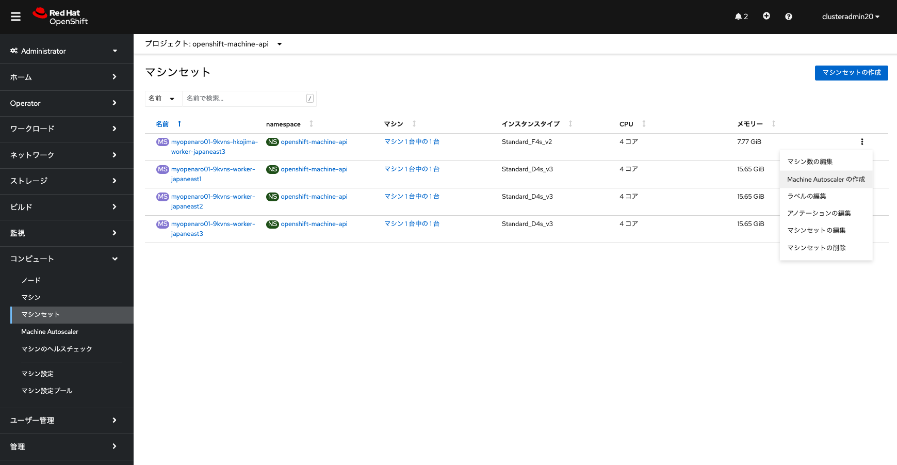
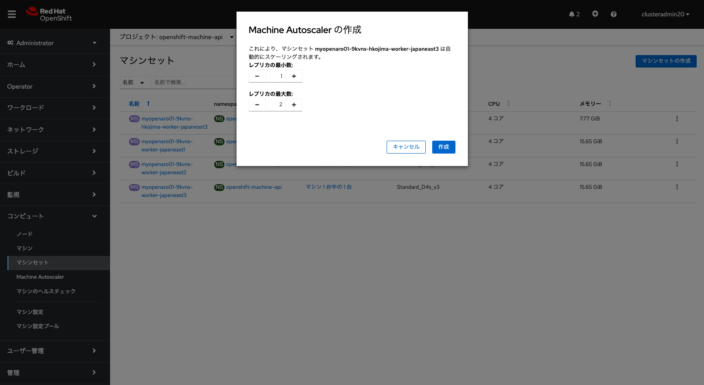
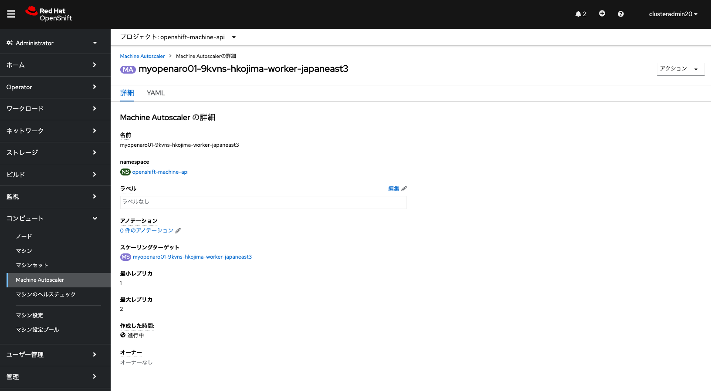
<div style="text-align: center;">Machineset Autoscalerの設定</div>　


### オートスケールのテスト

これまでの手順でオートスケールの設定が完了しましたので、実際にテストしてみます。管理ユーザアカウントで適当なプロジェクト(この例では、autoscale-ex20)を作成し、次のYAMLファイルでbusybox Podを15個並列に実行するジョブを投入します。このとき、先ほどマシンセットを作成する時に指定したラベルを利用して、このジョブによって作成されるPodが、受講者が作成したマシンセット内だけで実行されるように、「nodeSelector」を指定します。ラベルの「key: value」の「value」に相当する文字列(この例では、hkojima-worker-nodes)は、ダブルクォーテーションで囲む必要があります。これを忘れると、「value」の値が文字列として認識されないため、ラベルの指定ができず、CPU/メモリのリソースが空いている任意のコンピュートノードでPodが実行されるようになるため、注意してください。

```
apiVersion: batch/v1
kind: Job
metadata:
  generateName: work-queue-
spec:
  template:
    spec:
      nodeSelector:
        type: "hkojima-worker-nodes"
      containers:
      - name: work
        image: busybox
        command: ["sleep", "360"]
        resources:
          requests:
            memory: 500Mi
            cpu: 500m
      restartPolicy: Never
  backoffLimit: 4
  completions: 15
  parallelism: 15
```

OpenShiftでのジョブは、「ワークロード」メニューの「ジョブ」から「Jobの作成」をクリックして、上記YAMLファイルをコピペして「作成」をクリックすることで作成できます。ジョブの作成自体は管理ユーザだけでなくローカルユーザでも可能ですが、ローカルユーザの場合、自動的にスケールアウト/ダウンされるコンピュートノードの状態を見ることができないため、利便性を考慮して管理ユーザでジョブ作成を実行しています。


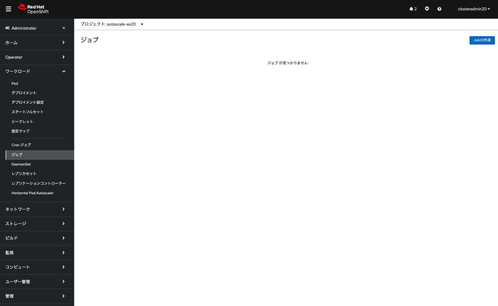
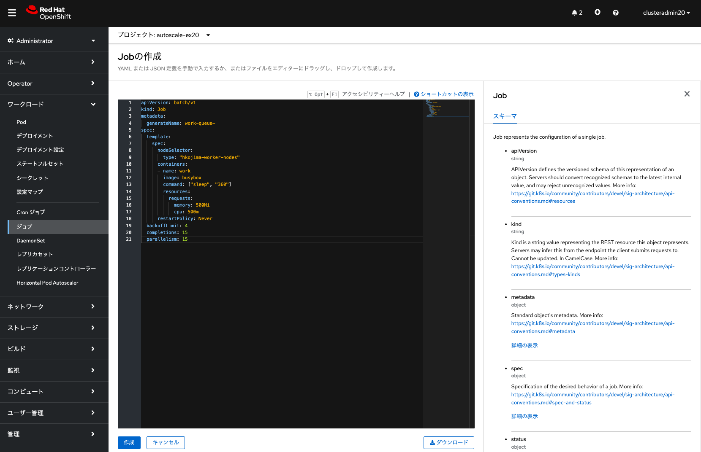
<div style="text-align: center;">ジョブの作成</div>　

ジョブを実行して数分待つと、ジョブの「Pod」から次のような実行状況の画面を確認できます。

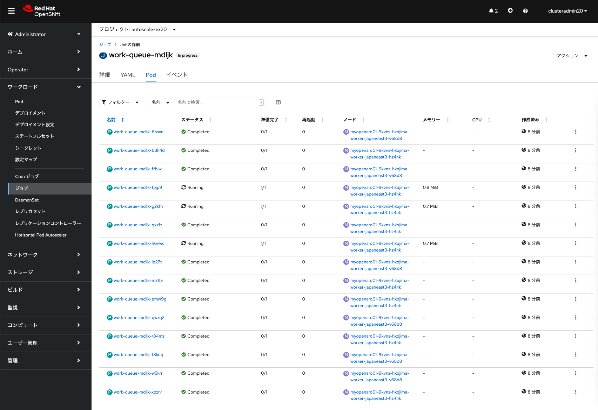
<div style="text-align: center;">ジョブの実行状況</div>　

Machineset Autoscalerを設定したマシンセットによって、自動的にコンピュートノードが追加され、追加されたコンピュートノード上でPodが実行されることを確認できます。これらは上記「ジョブ」メニューや、「コンピュート」の中にある「ノード」「マシン」「マシンセット」といったメニューを見ることで確認できます。


この演習のARO環境の場合、ジョブ実行が完了し、不要になったコンピュートノード1台がオートスケールダウンによって削除されるまで、20分ほどかかります。途中でジョブの実行を中止したい場合、当該ジョブを選択して、右上の「アクション」メニューから、「Jobの削除」を選択して「削除」を実行することで、ジョブを削除できます。これによりジョブによって起動されたPodが全て削除され、数分経つと、自動的にコンピュートノードが1台削除されます。

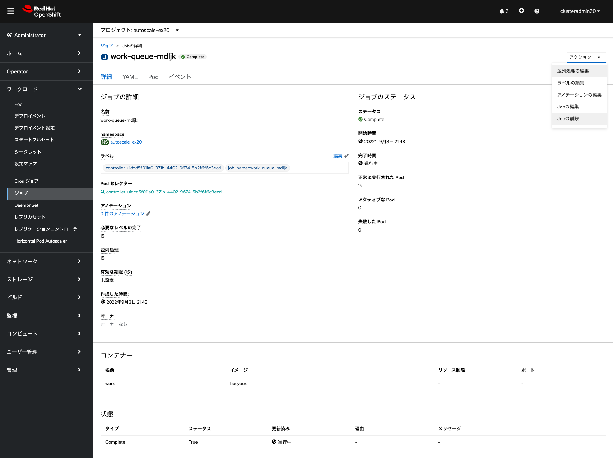
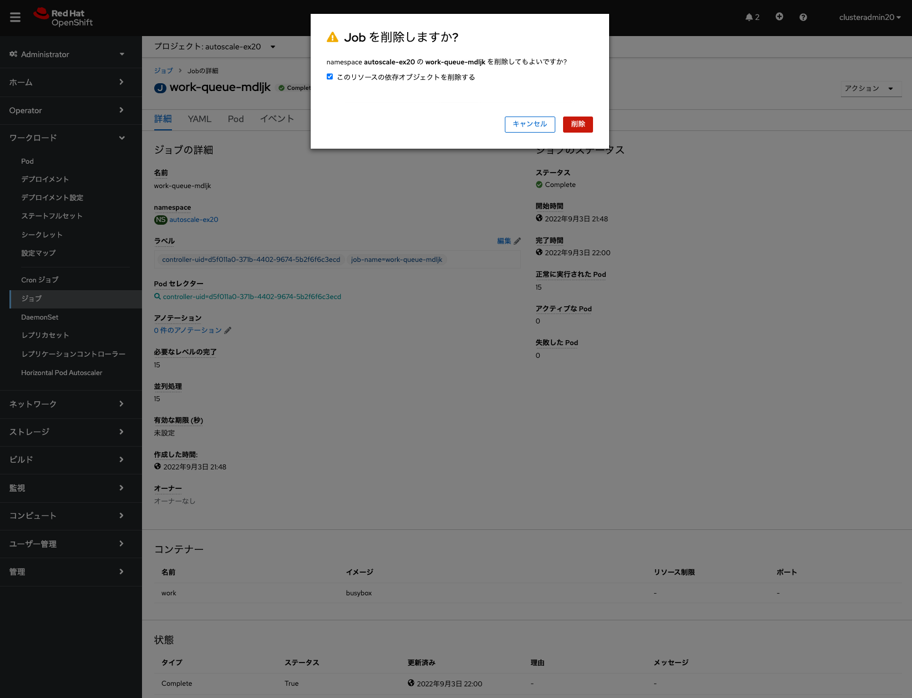
<div style="text-align: center;">ジョブの削除</div>　


最後に、受講者が作成したマシンセットを削除します。当該マシンセットの右横にある「・」が縦に3つ並んだアイコンをクリックして、「マシンセットの削除」から「削除」を選択することで、マシンセット及びそれに紐づく全てのコンピュートノードが削除されます。


<div style="text-align: center;">マシンセットの削除</div>　


これでAROの基本的な演習は終了です。この後は、インストラクターによる、[AROクラスターのアップグレード](../aro-upgrade)と[AROクラスターの削除](../aro-delete)のデモ紹介があります。

デモ紹介を待っている間、時間に余裕があれば、オプション演習の[AROクラスターでのJavaアプリケーション開発 スターターラボ](../aro-sample-app-develop)に進んでください。

#### \[参考情報\]

- [Azure Red Hat OpenShift (ARO) でスケーラブルなノード管理・運用](https://qiita.com/hatasaki/items/d1b6b64dd5a270d07f54)

[HOME](../../README.md)
