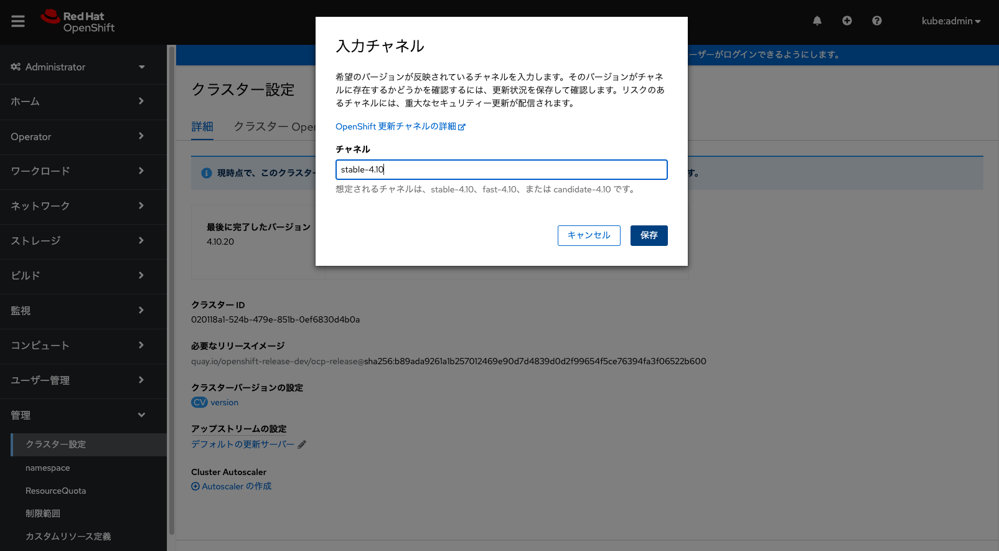
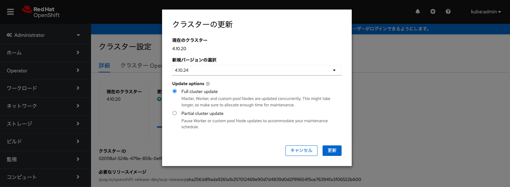
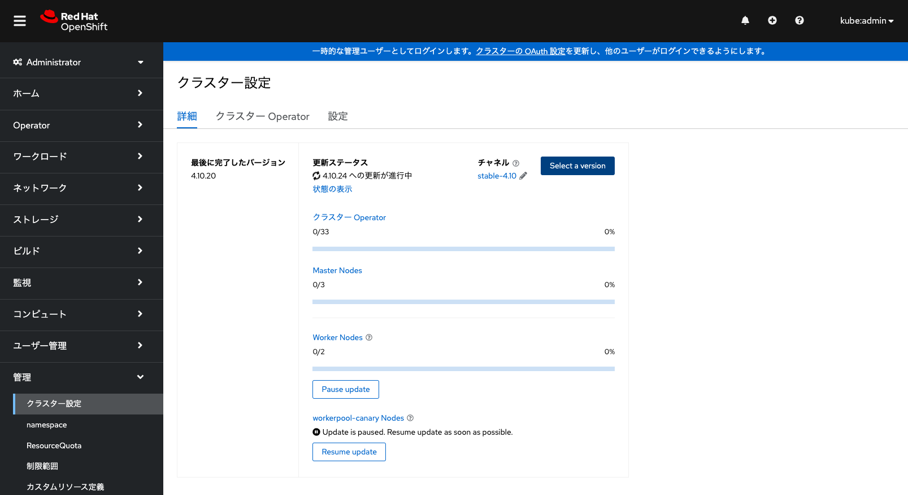
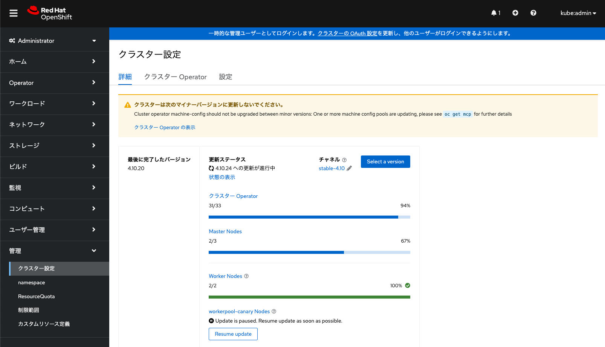
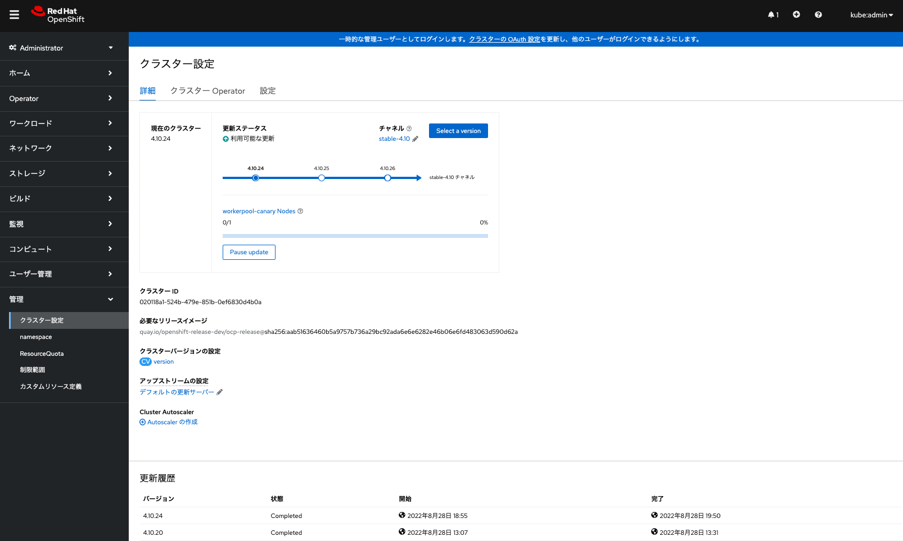
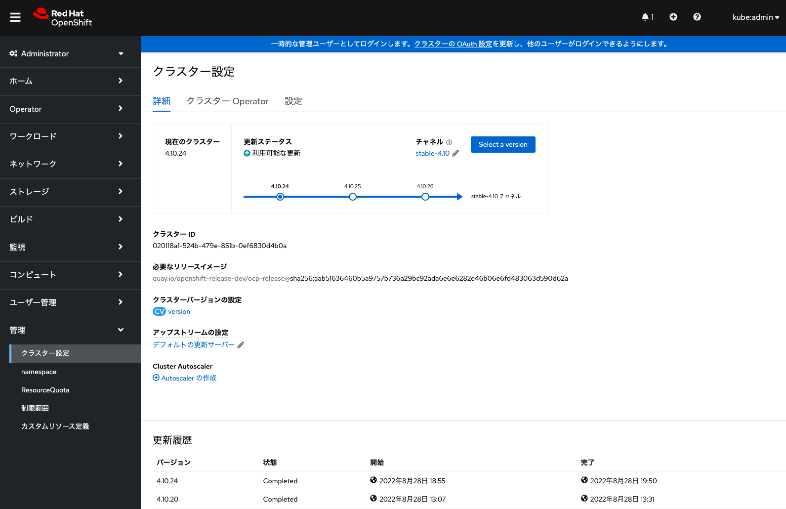
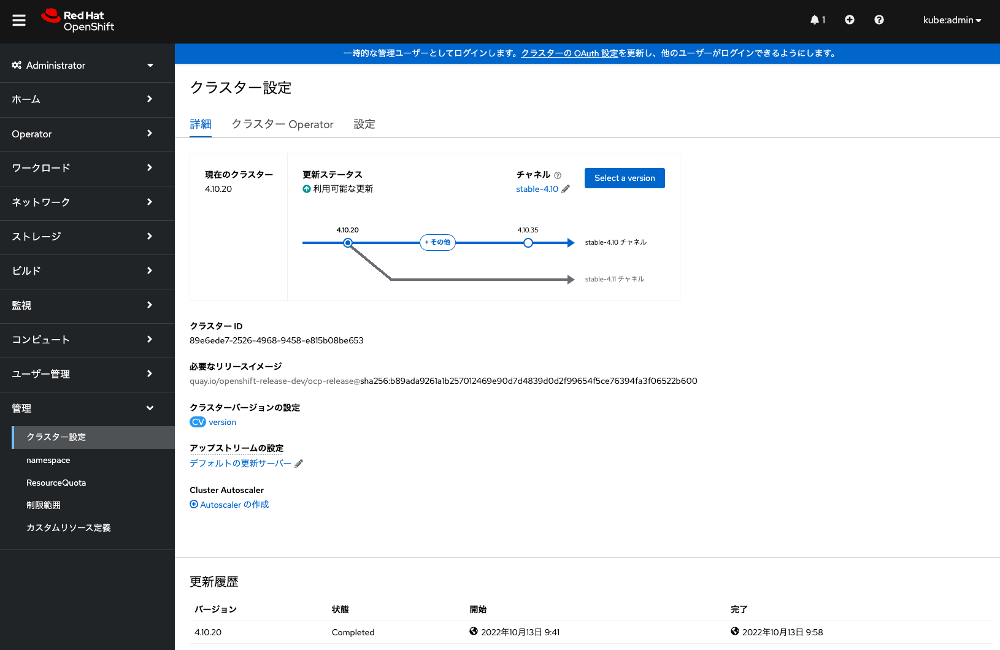
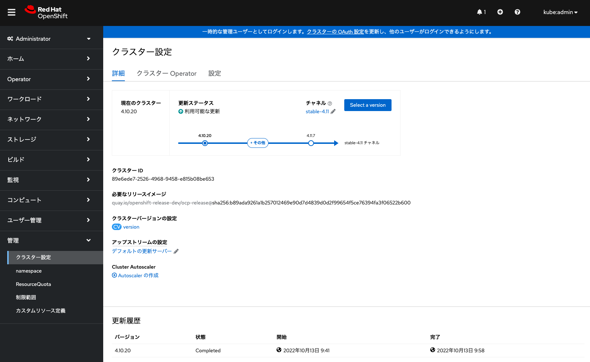
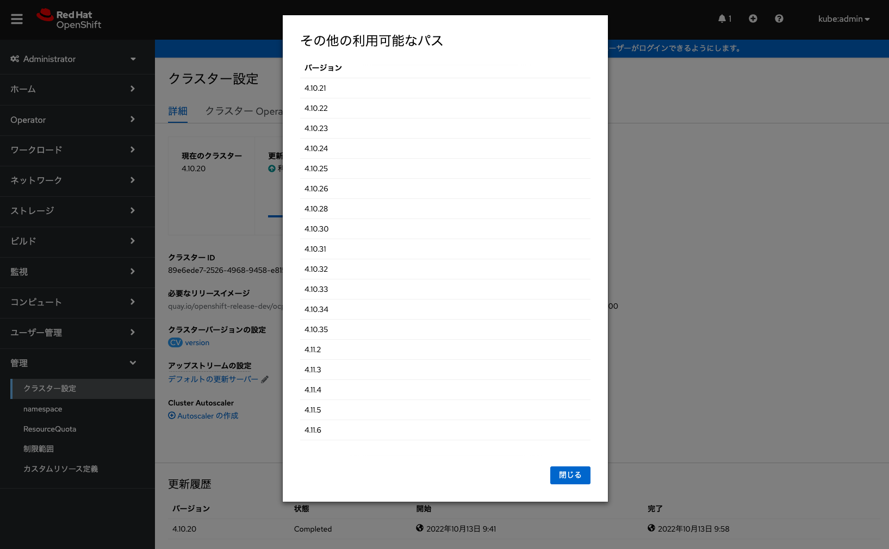

## AROクラスターのアップグレード

### 前準備

AROクラスターは、セルフマネージド版のOpenShiftと同様に、[Webコンソール](https://access.redhat.com/documentation/ja-jp/openshift_container_platform/4.11/html/updating_clusters/update-upgrading-web_updating-cluster-within-minor)や[CLI](https://access.redhat.com/documentation/ja-jp/openshift_container_platform/4.11/html/updating_clusters/update-upgrading-cli_updating-cluster-cli)を使用したアップグレードが可能です。ここでは、OpenShiftのWebコンソールを利用した、AROクラスターのアップグレード方法をご紹介します。

OpenShiftクラスターのrootユーザーである[kubeadminユーザー](https://access.redhat.com/documentation/ja-jp/openshift_container_platform/4.11/html/post-installation_configuration/understanding-kubeadmin_post-install-preparing-for-users)、または、クラスター管理権限となる[cluster-adminロール](https://access.redhat.com/documentation/ja-jp/openshift_container_platform/4.11/html/post-installation_configuration/post-install-using-rbac-to-define-and-apply-permissions#default-roles_post-install-preparing-for-users)が割り当てられたユーザーで、AROクラスターにログインして、「管理」の「クラスター設定」画面に移動します。

AROクラスターのデフォルトだと、更新チャネルが未設定の状態なので、チャネルを設定します。未設定の横の鉛筆マークをクリックして、チャネル名(この例では、stable-4.10)を入力して、「保存」をクリックします。

**[Tips]** AROでは、[「stable」チャネルのみがサポート対象のチャネル](https://learn.microsoft.com/en-us/azure/openshift/support-lifecycle#upgrade-channels)となります。




<div style="text-align: center;">更新チャネルの設定</div>　　

なお、一部のコンピュートノードを更新対象外にする(カナリアロールアウト更新)ことができます。その場合は、ラベルをつけた特定のノードのプール(Machine Config Pool, MCP)を作成する必要があります。

```
$ : ↓AROクラスターにkubeadminユーザでログイン
$ oc login --token=sha256~XXXXX --server=https://api.testmydomain01.japaneast.aroapp.io:6443


$ : ↓AROクラスターのコンピュートノードのリスト表示
$ oc get -l 'node-role.kubernetes.io/master!=' -o 'jsonpath={range .items[*]}{.metadata.name}{"\n"}{end}' nodes
testmyaro01-jnlll-worker-japaneast1-t676g
testmyaro01-jnlll-worker-japaneast2-8nbm2
testmyaro01-jnlll-worker-japaneast3-6tqgr
$ : ↓「oc label」コマンドによる「node-role.kubernetes.io/workerpool-canary=」ラベルの付与
$ oc label node testmyaro01-jnlll-worker-japaneast3-6tqgr node-role.kubernetes.io/workerpool-canary=
node/testmyaro01-jnlll-worker-japaneast3-6tqgr labeled


$ : ↓「node-role.kubernetes.io/workerpool-canary=」ラベルが付与されたノードを対象とする
$ :   OpenShiftのMachineConfigPoolリソースを作成
$ cat << EOF > worker-canary.yaml
apiVersion: machineconfiguration.openshift.io/v1
kind: MachineConfigPool
metadata:
  name: workerpool-canary
spec:
  machineConfigSelector:
    matchExpressions:
      - {
         key: machineconfiguration.openshift.io/role,
         operator: In,
         values: [worker,workerpool-canary]
        }
  nodeSelector:
    matchLabels:
      node-role.kubernetes.io/workerpool-canary: ""
EOF
$ oc create -f worker-canary.yaml
machineconfigpool.machineconfiguration.openshift.io/workerpool-canary created


$ : ↓OpenShiftのMachineConfigPoolリソース一覧を表示
$ oc get mcp
NAME                CONFIG                                                        UPDATED   UPDATING   DEGRADED   MACHINECOUNT   READYMACHINECOUNT   UPDATEDMACHINECOUNT   DEGRADEDMACHINECOUNT   AGE
master              rendered-master-b3a0f025835fde2aeb292b6344891769              True      False      False      3              3                   3                     0                      5h8m
worker              rendered-worker-e3b5c7f3534a74ba469358659178d170              True      False      False      2              2                   2                     0                      5h8m
workerpool-canary   rendered-workerpool-canary-e3b5c7f3534a74ba469358659178d170   True      False      False      1              1                   1                     0                      60s
```

ここで作成したMCP「workerpool-canary」を指定して、コンピュートノードのアップグレード対象外にすることが可能です。


### AROクラスターのアップグレード

「クラスター設定」画面から「Select a version」をクリックして、アップグレードするバージョン(リリース)を選択します。このとき、「Full cluster update」を選択すると、全てのコントローラ/コンピュートノードがアップグレードされます。「Partial cluster update」を選択すると、一部または全てのコンピュートノードをアップグレードから除外できます。ここでは、前述したMCP「workerpool-canary」に含まれるコンピュートノードを選択しています。そして「更新」をクリックして、AROクラスターのアップグレードを開始します。




<div style="text-align: center;">AROクラスターのアップグレード</div>　　


アップグレードを開始すると、次のような画面が表示されます。ここでは、「Partial cluster update」を選択して、1台のコンピュートノードをアップグレード対象外としています。




<div style="text-align: center;">AROクラスターのアップグレード状況 その1</div>　　


アップグレードしたコンピュートノードでアプリケーションが問題なく実行されることを確認したら、「Resume update」をクリックして、残り1台のコンピュートノードのアップグレードを完了できます。




<div style="text-align: center;">AROクラスターのアップグレード状況 その2</div>　


### AROクラスターのマイナーリリース間のアップグレード

AROクラスターは、4.10から4.11など、マイナーリリース間のアップグレードも可能です。AROクラスターの更新情報と更新イメージを配布するサービスは、Red Hatによって管理されています。そのため、セルフマネージド版OpenShiftのマイナーリリース間のアップグレードパスがRed Hatによって提供開始されたタイミングで、AROクラスターでも当該アップグレードパスを利用できるようになります。

AROクラスターで、マイナーリリース間のアップグレードが可能になった場合、次のような画面が表示されて、アップグレード対象のstableチャネルが利用可能であることが分かるようになっています。


<div style="text-align: center;">「stable-4.11」チャネルが利用可能になった例</div>　

このとき、前述の手順と同様の手順で、更新チャネルを「stable-4.10」から「stable-4.11」に変更すると、4.11へのアップグレードを選択・実施できるようになります。


<div style="text-align: center;">「stable-4.11」チャネルを設定</div>　

上記画面にある「+ その他」をクリックすることで、現在更新可能なリリースの一覧を確認できます。「stable-4.11」チャネルを設定しても、4.11系だけでなく4.10系にもアップグレードが可能です。


<div style="text-align: center;">更新可能なリリースの一覧</div>　

**[Tips]** AROの正式リリースとして提供開始される前に、ARO利用者がstableチャネルで利用可能な最新リリースにアップグレードすることは可能であり、かつ、サポート対象となります。ここで挙げてきた例のように、ARO v4.11がリリースされる前に、利用者が「stable-4.11」チャネルを設定して、ARO v4.10からARO v4.11にアップグレードできるため、本番環境のアップグレードの先行テストなどに利用できます。

> ".z" is representative of patch versions. If available in a stable upgrade channel, customers may also upgrade to 4.6.z.

[引用元: Red Hat OpenShift Container Platform version support policy (AROの公式ドキュメント)](https://learn.microsoft.com/en-us/azure/openshift/support-lifecycle#red-hat-openshift-container-platform-version-support-policy)


これで、AROクラスターアップグレードのデモ紹介は終了です。次は、インストラクターによる、[AROクラスター削除](../aro-delete)のデモ紹介です。


#### [参考情報]

- [第7章 カナリアロールアウト更新の実行](https://access.redhat.com/documentation/ja-jp/openshift_container_platform/4.10/html/updating_clusters/update-using-custom-machine-config-pools)


[HOME](../../README.md)
