## 永続ボリュームとしての Azure Disk/Files の利用設定

### [ハンズオン]Azure Diskの利用

AROには、Azure Diskを使用するストレージクラスが事前に設定されています。これにより、[Azure DiskのPremium SSD LRS(Locally Redundant Storage. ローカル冗長ストレージ)オプション](https://azure.microsoft.com/ja-jp/pricing/details/managed-disks/)がすぐに使えるように設定されています。

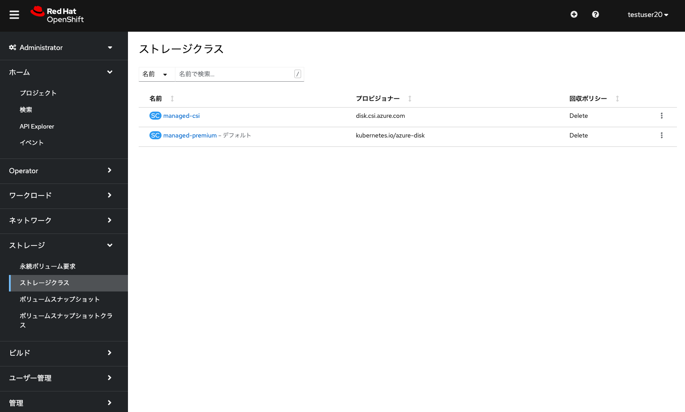
<div style="text-align: center;">AROですぐに利用可能なストレージクラス</div>　　

デフォルトのストレージクラスは、managed-premiumとして設定されており、外部ストレージを永続ボリュームとして利用する際のデフォルトとして利用されます。

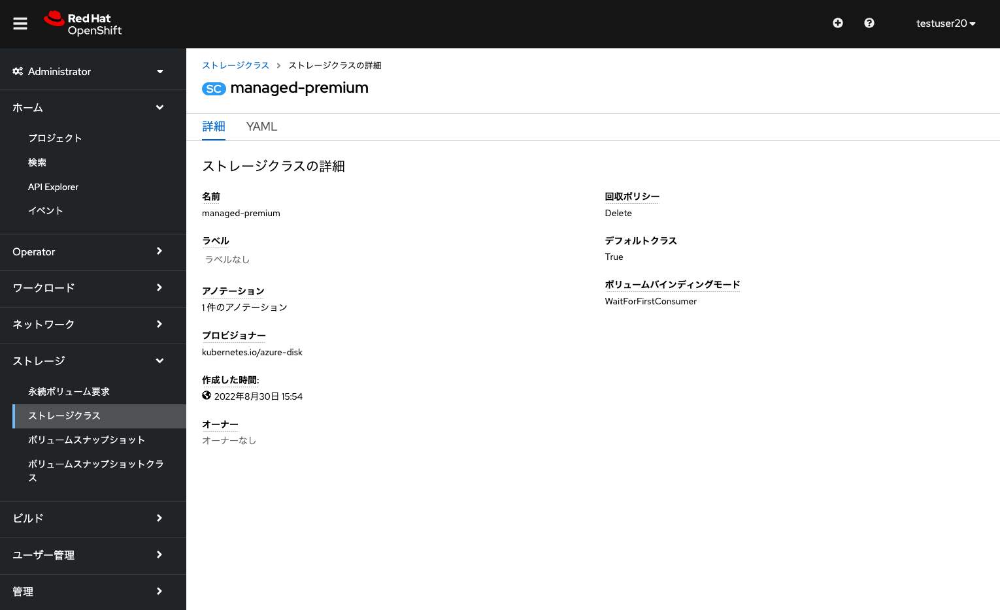
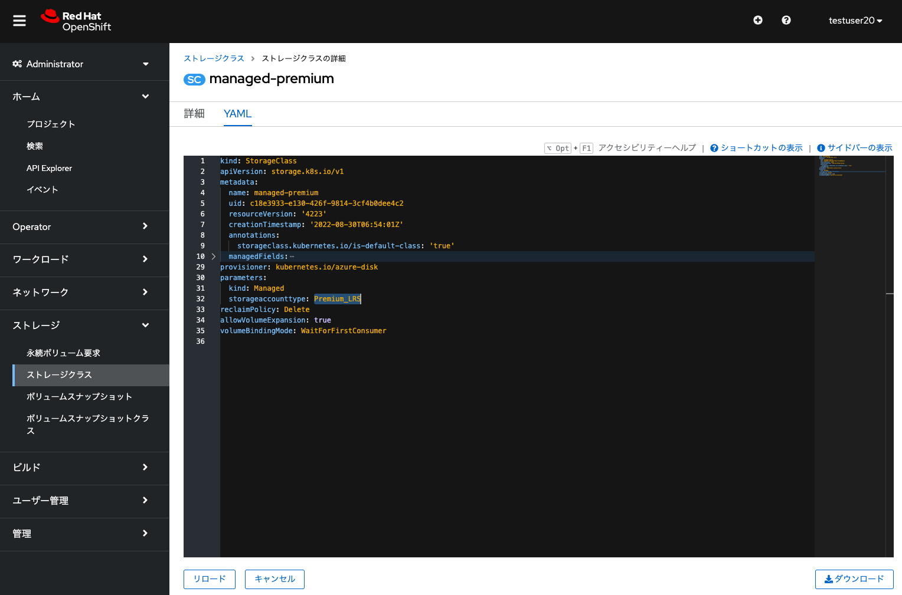
<div style="text-align: center;">managed-premiumストレージクラス</div>　　

また、前の演習で作成しました、PostgreSQLサンプルアプリでも、managed-premiumストレージクラスを利用して、Premium SSD LRSオプションのAzure Diskにデータを保存するように設定されています。

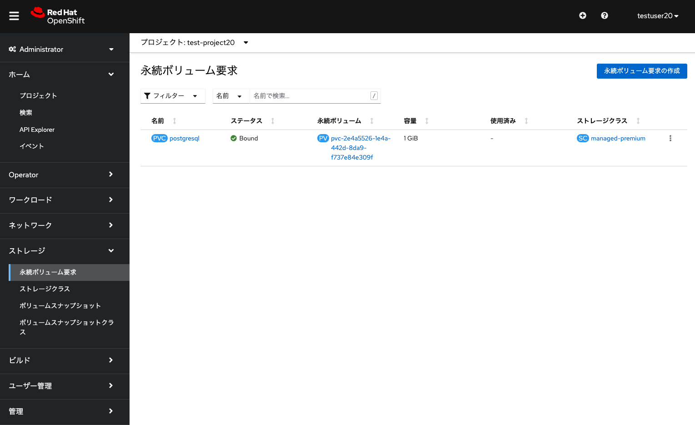
<div style="text-align: center;">PostgreSQLが利用する永続ボリューム (Persistent Volume, PV)</div>　

ここでmanaged-premiumストレージクラスを利用するために、新しく永続ボリューム要求(Persistent Volume Claim, PVC)を作成します。永続ボリューム要求の名前は、任意の名前(ここではtest-pvc-20)を入力し、要求するサイズは1GiBと指定します。なお、PVCはプロジェクトという名前空間の中にあるリソースです。そのため、プロジェクトごとに同じ名前のPVCが存在できます。例えば、プロジェクト1の中にPVC1、プロジェクト2の中にPVC1を作ることができます。ただし、1つのプロジェクトの中のリソース名の重複は許可されていないため、この例の場合だと、プロジェクト1の中にPVC1を2つ作ることはできません。

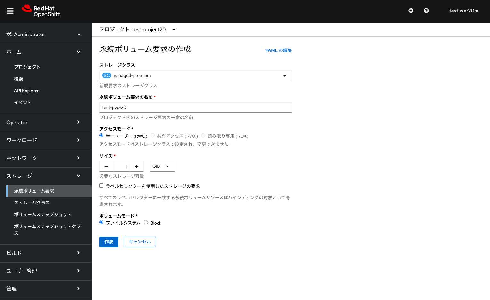
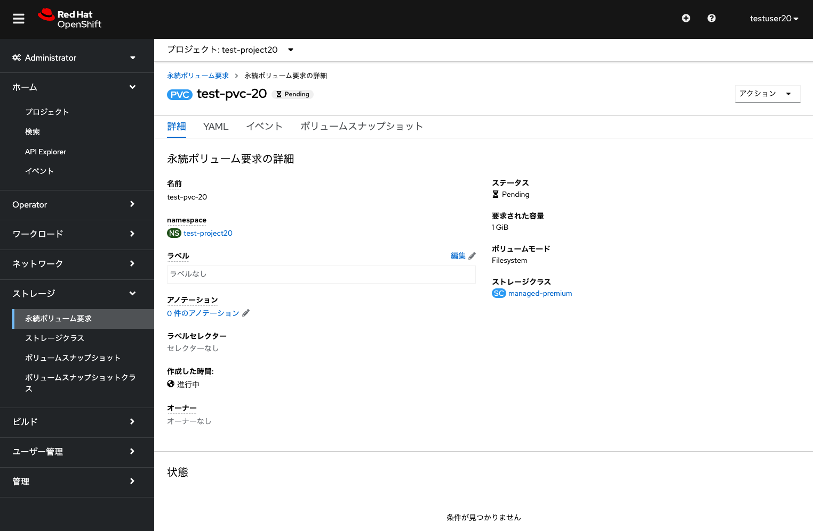
<div style="text-align: center;">PVC　(test-pvc-20) の作成</div>　　

このmanaged-premiumストレージクラスは、ボリュームバインディングモードが「WaitForFirstConsumer」と指定されており、最初にPodから永続ボリューム要求が利用されるまで、永続ボリュームの割り当てが行われない(ステータスがPendingのまま)ようになっています。ボリュームバインディングモードが「Immediate」となっている場合、PVC作成後すぐに永続ボリュームの割り当てが行われます。

そして、Podを作成します。「Podの作成」から、次のYAMLファイルを入力してPodを作成します。下記の「claimName: test-pvc-20」となっているところは、作成したPVCの名前に応じて、適宜変更してください。

\[Tips\]: PodはKubernetes/OpenShift上でのコンテナアプリの実行単位です。下記のYAMLファイルにあるとおり、コンテナ(この例ではCentOSコンテナの最新版を利用)やコンテナが利用する永続ボリュームの設定などをまとめたものになります。Podにはコンテナを複数まとめることもできますが、基本的には1つのPodには1つのコンテナを含むことを推奨しています。
```
apiVersion: v1
kind: Pod
metadata:
 name: test-azure-disk
spec:
 volumes:
   - name: azure-disk-vol
     persistentVolumeClaim:
       claimName: test-pvc-20
 containers:
   - name: test-azure-disk
     image: centos:latest
     command: [ "/bin/bash", "-c", "--" ]
     args: [ "while true; do touch /mnt/azure-disk-data/verify-azure-disk && echo 'hello azure-disk' && sleep 30; done;" ]
     volumeMounts:
       - mountPath: "/mnt/azure-disk-data"
         name: azure-disk-vol
```

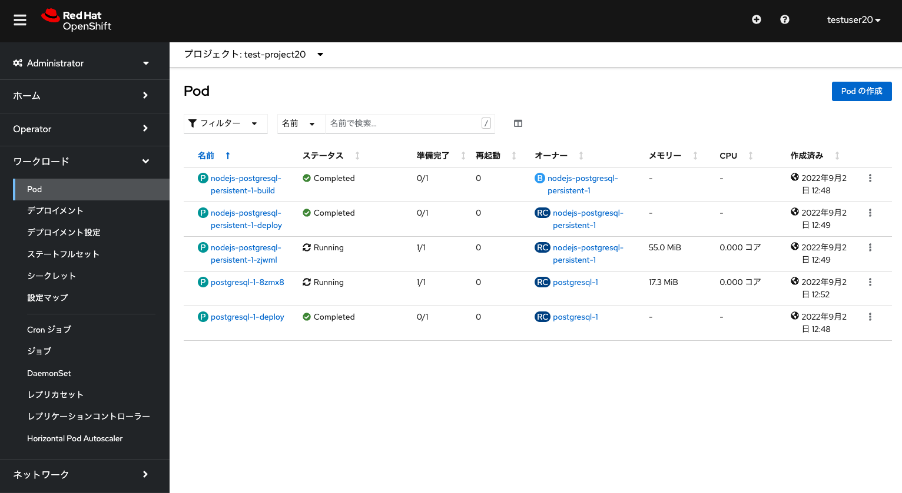
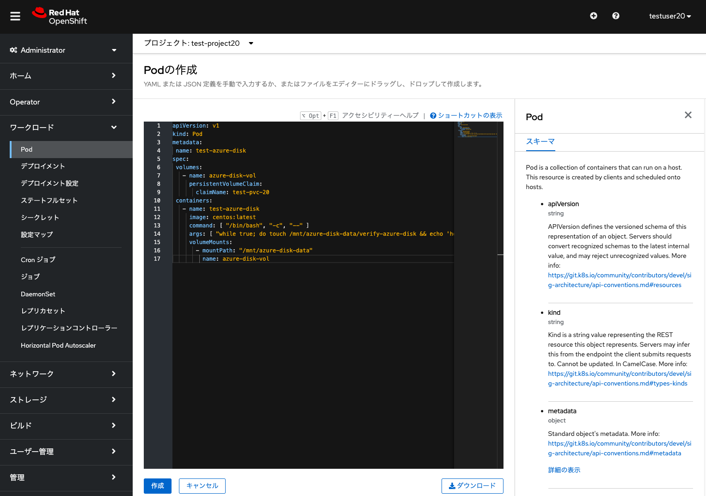
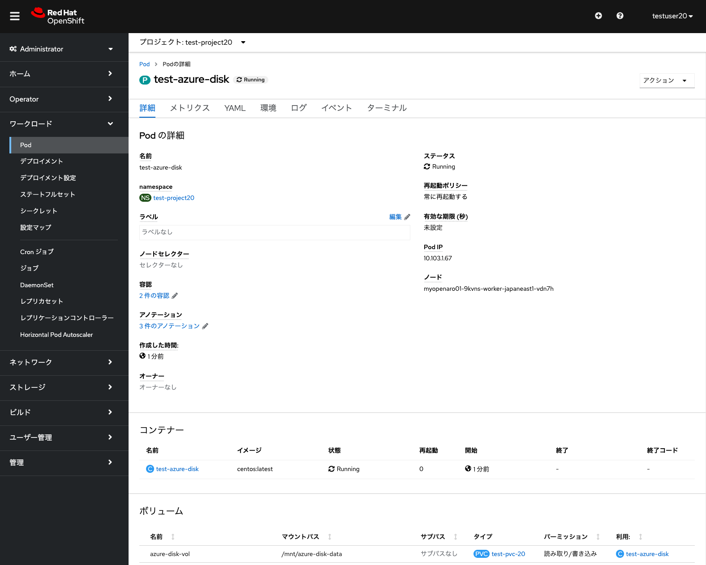
<div style="text-align: center;">Pod (test-azure-disk) の作成</div>　　

test-azure-diskという名前でPodが作成されて、Podにより「test-pvc-20」PVCが利用されて、永続ボリュームとして外部ストレージの利用が開始されます。

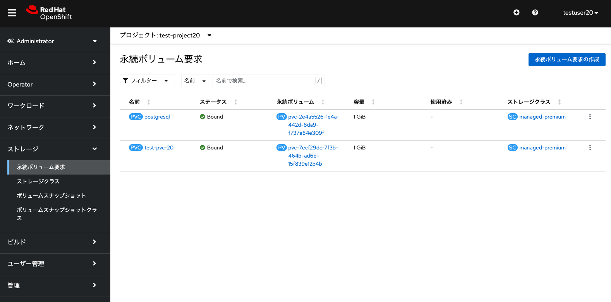
<div style="text-align: center;">PVC (test-pvc-20) の利用</div>　　

このPodのターミナルやログから、マウント状況や動作状況を確認できます。

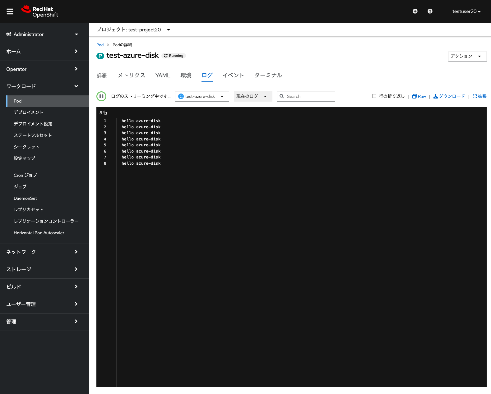
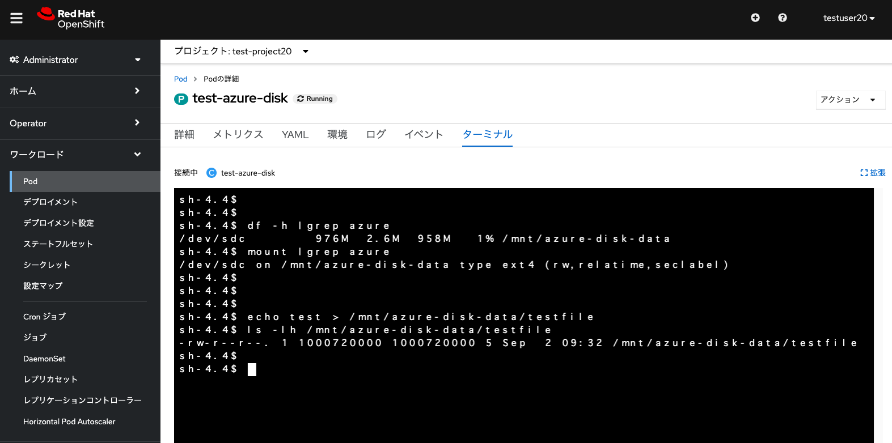
<div style="text-align: center;">Podの情報確認</div>　

ここで上記画像にあるように、ターミナルから、echoコマンドなどで永続ボリュームのマウントポイントである「/mnt/azure-disk-data」ディレクトリに、適当なファイルを作成します。Podを削除(該当Podを選択して、「アクション」->「Podの削除」を選択)した後に、再度「test-pvc-20」PVCを指定してPodを作成すると、作成したテストファイルが残っていることを確認できます。


### [デモ]Azure Filesの利用準備

※ここで紹介している内容は、インストラクターによって紹介されるデモ手順であり、受講者はコマンド操作を実施する必要はありません。次の「[ハンズオン]Azure Filesの利用」まで読み進めて下さい。

AROクラスターの複数のコンピュートノードから同時に読み書き可能な永続ボリュームとして、[Azure Files](https://azure.microsoft.com/ja-jp/pricing/details/storage/files/)を利用するように設定できます。このために、Azure Filesを利用するためのストレージクラスを、AROの管理ユーザーで作成する必要があります。

利用準備として、最初にAzureのストレージアカウントを作成します。指定したリソースグループの中に作成したストレージアカウントを利用して、Azure Filesが作成・利用されることになります。ストレージアカウント作成には、Azure CLI(azコマンド)による「az storage account create」コマンドを実行します。

```
$ :↓ 「East US」リージョンに、「openenv-XXXXX」という名前のリソースグループを作成
$ az group create -l eastus -n openenv-XXXXX

$ :↓ 「openenv-XXXXX」リソースグループに「arofilesXXXXXsa」という名前のストレージアカウントを作成
$ az storage account create -n arofilesXXXXXsa -g openenv-XXXXX --sku Standard_LRS
{
  "accessTier": "Hot",
  "allowBlobPublicAccess": true,
...<略>...
  "kind": "StorageV2"
...<略>...
  "location": "eastus",
...<略>...
  "minimumTlsVersion": "TLS1_0",
  "name": "arofilesXXXXXsa",
...<略>...
  "sku": {
    "name": "Standard_LRS",
    "tier": "Standard"
  },
  "statusOfPrimary": "available",
  "statusOfSecondary": null,
  "storageAccountSkuConversionStatus": null,
  "tags": {},
  "type": "Microsoft.Storage/storageAccounts"
}
```

作成したストレージアカウントは、Azure Portalで次のように表示されます。ここではAROクラスターを作成しているリソースグループに、ストレージアカウントを作成しています。

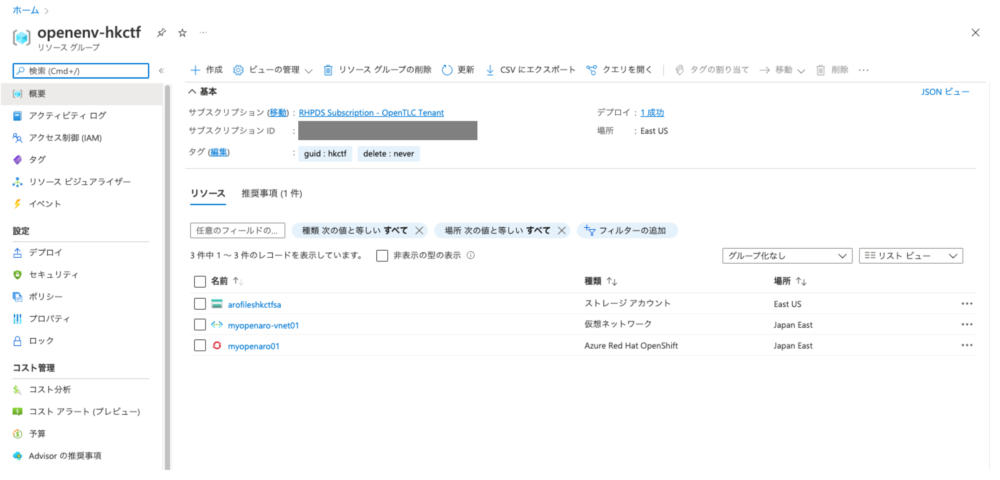
<div style="text-align: center;">Azure ストレージアカウントの表示</div>　　


最初にご紹介した「AROクラスターの作成」手順で利用したAROのサービスプリンシパルに対して、作成したストレージアカウントのリソースグループに対するアクセス許可が必要となるので、これを「az role assignment」コマンドで設定します。ここでは、「Contributor(共同作成者)」の権限を割り当てて、全てのリソースを管理するためのフルアクセス権限を付与しています。

```
$ az role assignment create --role Contributor --scope /subscriptions/<AzureのサブスクリプションID>/resourceGroups/<Azureストレージアカウントを作成したリソースグループのID> --assignee <AROサービスプリンシパルのアプリケーションID>
```

ロールの割り当て結果は、Azure Portalで次のように表示されます。ここでは、「openenv-aro-XXXXX」というAROのサービスプリンシパルに対して、「openenv-XXXXX」リソースグループに対する権限が設定されています。

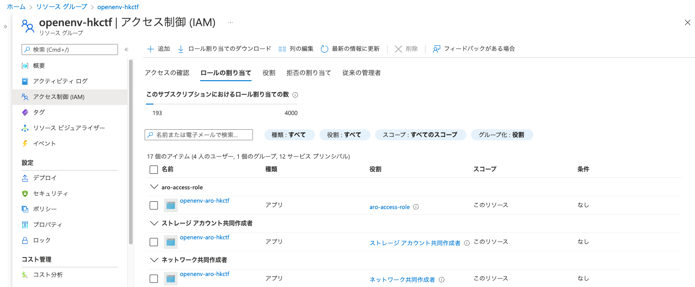
<div style="text-align: center;">ストレージアカウントのリソースグループに対するアクセス制御</div>　　


続いて、AROクラスター側でアクセス許可を設定します。OpenShiftの[サービスアカウント](https://access.redhat.com/documentation/ja-jp/openshift_container_platform/4.11/html/authentication_and_authorization/understanding-and-creating-service-accounts)の設定を編集します。サービスアカウントは、OpenShiftの各プロジェクトに存在するオブジェクトであり、ユーザーの認証情報を共有せずに各コンポーネントがAPIアクセスを制御するための方法を提供します。ここでは、Azure Filesのプロビジョニングの際に、Azureストレージアカウントとキーを保存するOpenShiftシークレットを作成・取得するための権限が「persistent-volume-binder」サービスアカウントに必要となるため、「oc adm policy add-cluster-role-to-user」コマンドで割り当てています。
```
$ :↓ OpenShift CLIであるocコマンドを利用して、管理ユーザー(kubeadmin)でログイン
$ oc login --token=sha256~XXXXX --server=https://api.myopendomain01.japaneast.aroapp.io:6443

$ oc create clusterrole azure-secret-reader --verb=create,get --resource=secrets
$ oc adm policy add-cluster-role-to-user azure-secret-reader system:serviceaccount:kube-system:persistent-volume-binder
```


最後にAzure Filesを利用するためのストレージクラスを作成するために、YAMLファイルを作成して、「oc create」コマンドを実行します。主なパラメータの説明は次のとおりです。

- name: 作成するストレージクラスの任意の名前。ここでは「azure-files」を指定
- location: ストレージアカウントを作成したリージョン(East US)を指定
- secretNamespace: Azureストレージアカウントとキーを保存するプロジェクト(kube-system)を指定
- skuName: Azure FilesのSKUを指定
- storageAccount: 作成したストレージアカウントを指定
- resourceGroup: ストレージアカウントを作成したリソースグループを指定

```
$ cat << EOF > azure-storageclass-azure-file.yaml
kind: StorageClass
apiVersion: storage.k8s.io/v1
metadata:
  name: azure-files
provisioner: kubernetes.io/azure-file
parameters:
  location: eastus 
  secretNamespace: kube-system
  skuName: Standard_LRS
  storageAccount: arofilesXXXXXsa
  resourceGroup: openenv-XXXXX
reclaimPolicy: Delete
volumeBindingMode: Immediate
EOF
$ oc create -f azure-storageclass-azure-file.yaml
```

ここまでの手順により、Azure Filesをストレージクラスとして利用する準備が完了しました。表示されるストレージクラスのリストに、「azure-files」が追加されていることを確認できます。


<div style="text-align: center;">「azure-files」ストレージクラスの追加を確認</div>　　


### [ハンズオン]Azure Filesの利用

ここまでの手順によって設定された「azure-files」ストレージクラスにより、Azure Filesを永続ボリュームとして利用できます。永続ボリュームを利用する際は、Azure Diskの時と同様に、「ストレージ」→「永続ボリューム要求」→「永続ボリューム要求の作成」から、PVCを作成することで利用できるようになります。

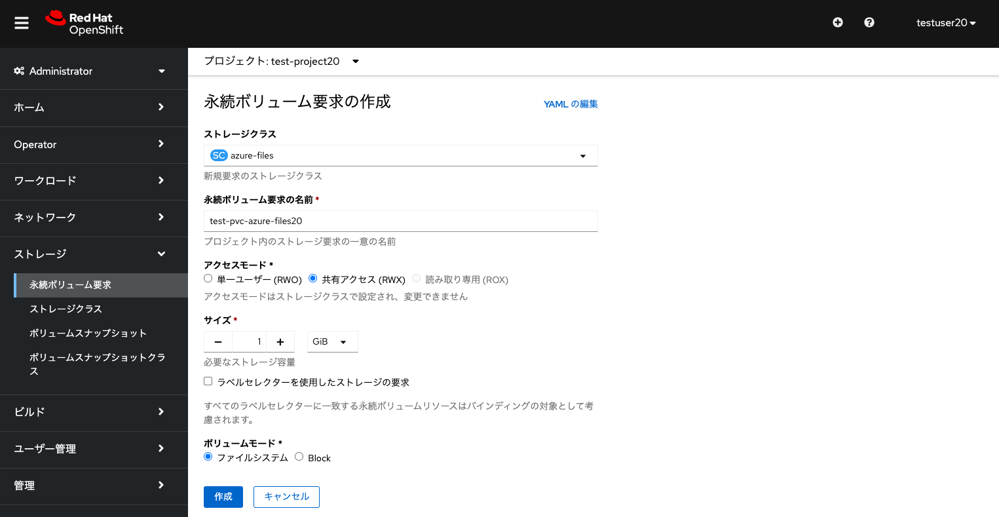
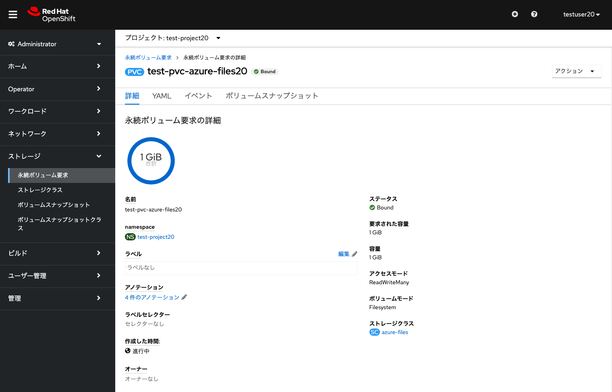
<div style="text-align: center;">PVC　(test-pvc-azure-files20) の作成</div>

ここでストレージクラスとして「azure-files」を選択すると、アクセスモードとして「共有アクセス(RWX)」が選択できるようになっていることを確認できます。Azure Diskの場合は、RWO(1台のコンピュートノードからのみ利用可能)だけを選択できましたが、Azure Filesの場合は、RWOに加えてRWX(複数台のコンピュートノードから利用可能)も選択できます。RWXのアクセスモードに対応したPVCを利用することで、複数ノード上でレプリケーション構成を取るアプリケーション(Azure Filesに保存したデータを共有)をARO上で実行できるようになります。

Azure Diskの時と同様に、次のYAMLファイルを利用して、作成した「test-pvc-azure-files20」PVCを利用したPodを実行します。
```
apiVersion: v1
kind: Pod
metadata:
 name: test-azure-files
spec:
 volumes:
   - name: azure-files-vol
     persistentVolumeClaim:
       claimName: test-pvc-azure-files20
 containers:
   - name: test-azure-files
     image: centos:latest
     command: [ "/bin/bash", "-c", "--" ]
     args: [ "while true; do touch /mnt/azure-files-data/verify-azure-files && echo 'hello azure-files' && sleep 30; done;" ]
     volumeMounts:
       - mountPath: "/mnt/azure-files-data"
         name: azure-files-vol
```

Podのターミナルからマウント状況を確認すると、CIFSプロトコルでマウントされていることを確認できます。

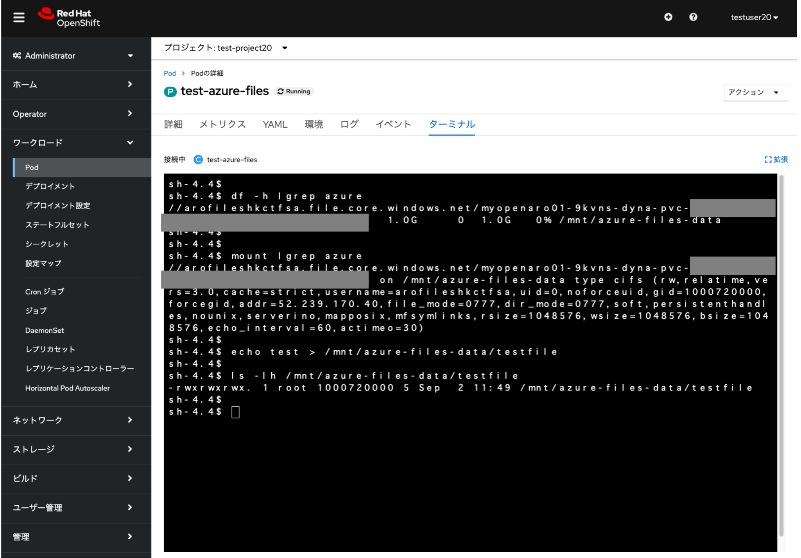
<div style="text-align: center;">Podの情報確認</div>　

また、Azure Portalにアクセスできる場合は、Azure Filesの作成に利用しているストレージアカウントを選択して、左サイドメニューから「ファイル共有」から、現在のAzure Filesの利用状況を確認できます。この演習では、受講者はAzure Portalのストレージアカウントにアクセスできる権限を持たないことを想定しますので、実際にアクセスして確認することはできません。

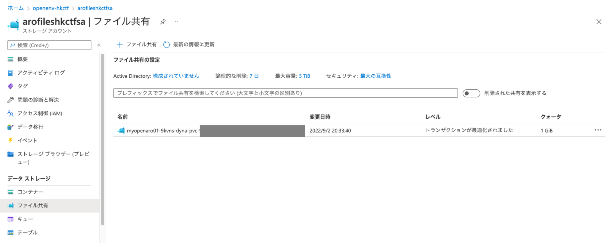
<div style="text-align: center;">Azure Portalでのファイル共有利用状況の確認</div>　


これでAROクラスターでの、永続ボリュームとしてのAzure Disk/Filesを利用する設定と確認が完了しました。次の演習の[Azure Service Operator による Azure リソースの利用](../aro-azure-resource)に進んでください。


#### \[参考情報\]

- [Azure Red Hat OpenShift 4 で Azure Files StorageClass を作成する](https://docs.microsoft.com/ja-jp/azure/openshift/howto-create-a-storageclass)

[HOME](../../README.md)
