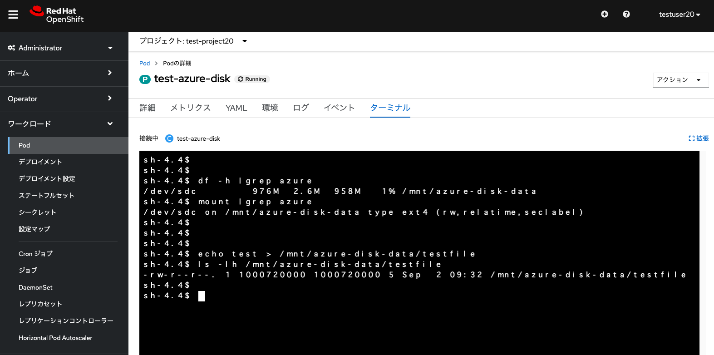

## 永続ボリュームとしての Azure Disk/Files の利用設定

### Azure Diskの利用

AROには、Azure Diskを使用するストレージクラスが事前に設定されています。これにより、[Azure DiskのPremium SSD LRS(Locally Redundant Storage. ローカル冗長ストレージ)オプション](https://azure.microsoft.com/ja-jp/pricing/details/managed-disks/)がすぐに使えるように設定されています。


<div style="text-align: center;">AROですぐに利用可能なストレージクラス</div>　　

デフォルトのストレージクラスは、managed-premiumとして設定されており、外部ストレージを永続ボリュームとして利用する際のデフォルトとして利用されます。


<div style="text-align: center;">managed-premiumストレージクラス</div>　　

また、前の演習で作成しました、PostgreSQLサンプルアプリでも、managed-premiumストレージクラスを利用して、Premium SSD LRSオプションのAzure Diskにデータを保存するように設定されています。


<div style="text-align: center;">PostgreSQLが利用する永続ボリューム (Persistent Volume, PV)</div>　

ここでmanaged-premiumストレージクラスを利用するために、新しく永続ボリューム要求(Persistent Volume Claim, PVC)を作成します。永続ボリューム要求の名前は、任意の名前(ここではtest-pvc-20)を入力し、要求するサイズは1GiBと指定します。なお、PVCはプロジェクトという名前空間の中にあるリソースです。そのため、プロジェクトごとに同じ名前のPVCが存在できます。例えば、プロジェクト1の中にPVC1、プロジェクト2の中にPVC1を作ることができます。ただし、1つのプロジェクトの中のリソース名の重複は許可されていないため、この例の場合だと、プロジェクト1の中にPVC1を2つ作ることはできません。


<div style="text-align: center;">PVC　(test-pvc-20) の作成</div>　　

このmanaged-premiumストレージクラスは、ボリュームバインディングモードが「WaitForFirstConsumer」と指定されており、最初にPodから永続ボリューム要求が利用されるまで、永続ボリュームの割り当てが行われない(ステータスがPendingのまま)ようになっています。ボリュームバインディングモードが「Immediate」となっている場合、PVC作成後すぐに永続ボリュームの割り当てが行われます。

そして、Podを作成します。「Podの作成」から、次のYAMLファイルを入力してPodを作成します。下記の「claimName: test-pvc-20」となっているところは、作成したPVCの名前に応じて、適宜変更してください。

\[Tips\]: PodはKubernetes/OpenShift上でのコンテナアプリの実行単位です。下記のYAMLファイルにあるとおり、コンテナ(この例ではCentOSコンテナの最新版を利用)やコンテナが利用する永続ボリュームの設定などをまとめたものになります。Podにはコンテナを複数まとめることもできますが、基本的には1つのPodには1つのコンテナを含むことを推奨しています。
```
apiVersion: v1
kind: Pod
metadata:
 name: test-azure-disk
spec:
 volumes:
   - name: azure-disk-vol
     persistentVolumeClaim:
       claimName: test-pvc-20
 containers:
   - name: test-azure-disk
     image: centos:latest
     command: [ "/bin/bash", "-c", "--" ]
     args: [ "while true; do touch /mnt/azure-disk-data/verify-azure-disk && echo 'hello azure-disk' && sleep 30; done;" ]
     volumeMounts:
       - mountPath: "/mnt/azure-disk-data"
         name: azure-disk-vol
```


<div style="text-align: center;">Pod (test-azure-disk) の作成</div>　　

test-azure-diskという名前でPodが作成されて、Podにより「test-pvc-20」PVCが利用されて、永続ボリュームとして外部ストレージの利用が開始されます。


<div style="text-align: center;">PVC (test-pvc-20) の利用</div>　　

このPodのターミナルやログから、マウント状況や動作状況を確認できます。



<div style="text-align: center;">Podの情報確認</div>　

ここで上記画像にあるように、ターミナルから、echoコマンドなどで永続ボリュームのマウントポイントである「/mnt/azure-disk-data」ディレクトリに、適当なファイルを作成します。Podを削除(該当Podを選択して、「アクション」->「Podの削除」を選択)した後に、再度「test-pvc-20」PVCを指定してPodを作成すると、作成したテストファイルが残っていることを確認できます。


### Azure Filesの利用

Azure Files


これでAROクラスターでの、永続ボリュームとしてのAzure Disk/Filesを利用する設定と確認が完了しました。次の演習の[Azure Service Operator による Azure リソースの利用](../aro-azure-resource)に進んでください。

[HOME](../../README.md)
